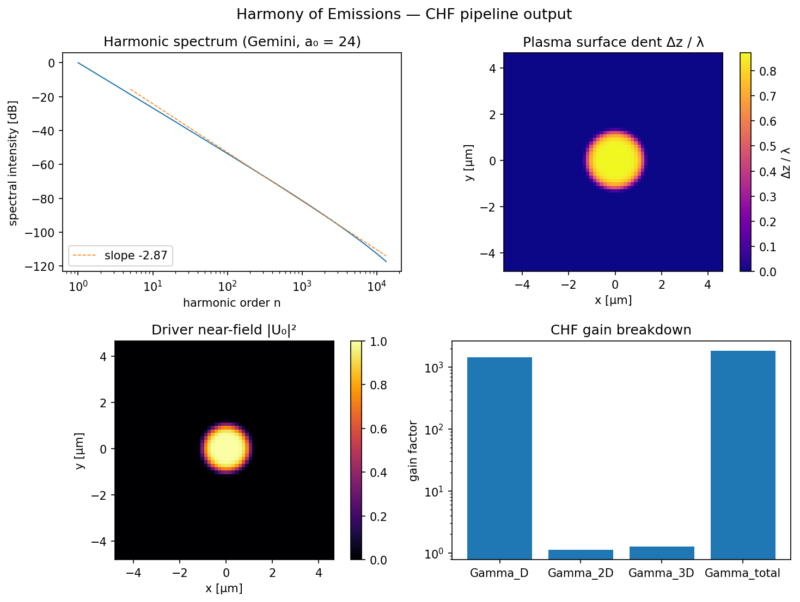
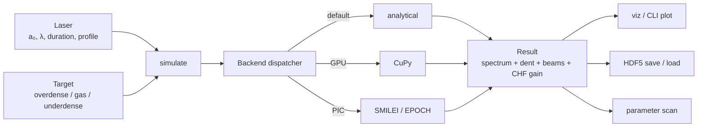
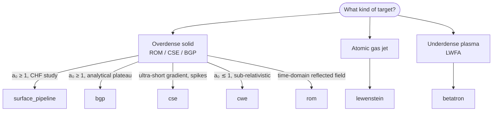
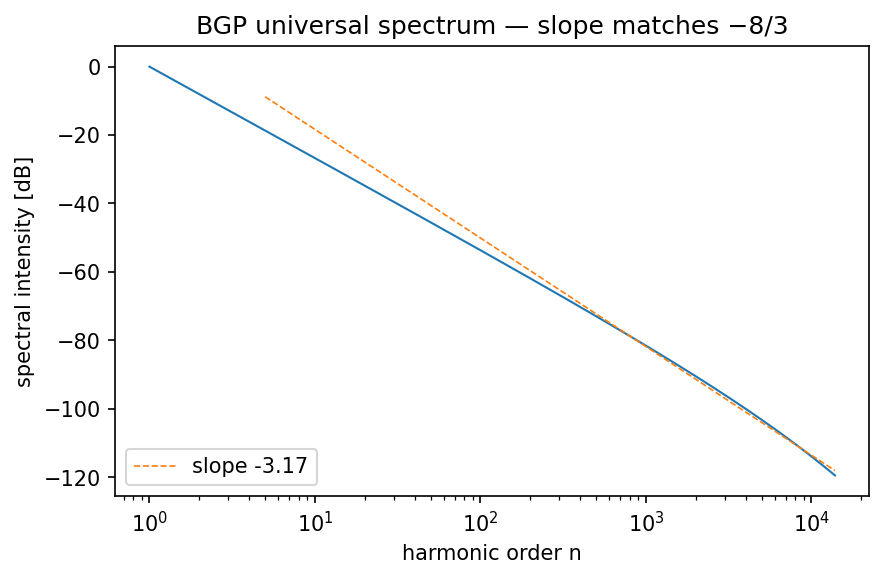

# Harmony of Emissions

Configurable high-frequency laser-plasma emission sources — a Python
workflow for simulating the main routes to coherent, attosecond-scale,
high-harmonic radiation, and for projecting them into the
**Coherent Harmonic Focus (CHF)** regime demonstrated by Timmis et al.,
[*Nature* (2026)](https://doi.org/10.1038/s41586-026-10400-2).



*Spectrum (top-left), 2-D dent map Δz/λ (top-right), driver near-field
intensity (bottom-left), and CHF gain breakdown Γ_D · Γ_2D · Γ_3D
(bottom-right) — all computed from `configs/chf_gemini.yaml` and plotted
with `harmony plot`. See [`docs/gallery.md`](docs/gallery.md) for the
full set of capabilities.*

## Architecture at a glance



## What the library covers

| Regime                                            | Model(s)             | Key scaling                  |
|---------------------------------------------------|----------------------|------------------------------|
| Surface HHG on overdense plasma (ROM)             | `rom`, `bgp`         | I(n) ∝ n^(−8/3), n_c ∝ γ³    |
| Surface HHG (coherent synchrotron emission)       | `cse`                | I(ω) ∝ ω^(−4/3), spikes      |
| Sub-relativistic surface HHG (coherent wake)      | `cwe`                | cutoff at √(n_e/n_c) (a₀-indep)|
| Gas-phase HHG                                     | `lewenstein`         | cutoff at I_p + 3.17 U_p     |
| LWFA betatron                                     | `betatron`           | ω_c = (3/2) γ³ ω_β² r_β / c  |
| **Coherent Harmonic Focus (Timmis 2026)**         | **`surface_pipeline`** | **I_CHF/I ∝ a₀³**          |
| Hot-electron bremsstrahlung (keV continuum)       | `bremsstrahlung`     | dI/dE ∝ E₁(E/T_hot), Wilks   |
| Kα fluorescence on solid targets                  | `kalpha`             | ω_K · σ_K(T_hot), material-pinned |
| Inverse Compton Scattering / γ-rays               | `ics`                | E_γ = 4γ²ħω₀ / (1 + 4γE_L/m_ec²) |

## DPSSL quickstart (Yb:YAG 1030 nm drivers)

```bash
harmony list-presets                                  # HAPLS, DiPOLE, BIVOJ, POLARIS, ...
harmony validate configs/hapls_surface_hhg.yaml       # dry-run
harmony chf      configs/hapls_surface_hhg.yaml -o hapls.h5
harmony detector hapls.h5 --band xray-soft --filter kapton-7um --detector si-500um
harmony plot     hapls.h5 -k instrument
```

Any config can pull a facility's wavelength / duration / polarization from
a named preset via `laser.preset: hapls` — user-set fields still win. See
[`docs/presets.md`](docs/presets.md) for the full catalogue and
[`docs/hard_xray.md`](docs/hard_xray.md) for the keV → MeV pipeline.

Every model returns the same `Result` object — spectrum plus (for the
`surface_pipeline`) a 2-D dent map, driver and diagnostic-harmonic beam
profiles, and a CHF gain breakdown — so plotting, saving, and parameter
sweeps are regime-agnostic.

### Picking a model





*Analytical BGP spectrum at a₀ = 30 — the measured plateau slope (−2.68) tracks the universal −8/3 prediction.*

## Install

```bash
pip install -e .                 # library + CLI
pip install -e ".[dev]"          # + pytest / nbmake / mypy / ruff
pip install -e ".[accel]"        # + numba (optional hot-loop accel)
```

## Quick start (Python)

```python
from harmonyemissions import Laser, Target, simulate
from harmonyemissions.config import NumericsConfig

# Gemini-class shot — the Timmis 2026 reference point.
laser = Laser(a0=24.0, wavelength_um=0.8, duration_fs=50.0,
              spatial_profile="super_gaussian", spot_fwhm_um=2.0,
              super_gaussian_order=8, angle_deg=45.0)
target = Target.sio2(t_HDR_fs=351.0,
                     prepulse_intensity_rel=1e-3, prepulse_delay_fs=100.0)

result = simulate(laser, target, model="surface_pipeline")
print(result.chf_gain)           # Gamma_D, Gamma_2D, Gamma_3D, Gamma_total
result.spectrum                  # xarray: η_n vs harmonic order
result.dent_map                  # xarray: Δz(x', y') / λ
result.beam_profile_far          # xarray: per-harmonic far-field intensity
result.save("gemini.h5")
```

## Quick start (CLI)

```bash
# Validate a config (pydantic schema check only — cheap):
harmony validate configs/chf_gemini.yaml

# Run the full CHF pipeline and print the Γ breakdown:
harmony chf      configs/chf_gemini.yaml -o gemini.h5

# Apply the XUV instrument response (Al filter, grating, CCD):
harmony detector gemini.h5 --al-um 1.5 -o gemini_ccd.h5

# Plot variants:
harmony plot gemini.h5 -k spectrum
harmony plot gemini.h5 -k dent
harmony plot gemini.h5 -k beam
harmony plot gemini.h5 -k chf
harmony plot gemini_ccd.h5 -k instrument

# Parameter sweeps — Cartesian product over any number of YAML paths:
harmony scan configs/dpm_contrast_scan.yaml \
    -p target.t_HDR_fs=250,351,500,711,1000 -d runs/thdr/ -j 4
```

## Documentation

- [`docs/overview.md`](docs/overview.md) — whole-project tour: capability
  matrix across every regime, Mermaid architecture diagrams, the unified
  `Result` schema, acceleration tiers, and where the in-progress 3-D
  extension fits.
- [`docs/theory.md`](docs/theory.md) — physics derivations and scaling
  laws for every regime, including the CHF pipeline (Timmis 2026
  Methods eqs. 7–12).
- [`docs/chf.md`](docs/chf.md) — walkthrough of the Coherent Harmonic
  Focus module, its pipeline stages, and the a₀³ scaling law.
- [`docs/chf3d.md`](docs/chf3d.md) — **in-progress 3-D N-beam coherent
  harmonic focus** extension: platonic / structured-light / time-multiplexed
  architectures, coherent-superposition gain law, geometry primitives,
  config schema, and roadmap.
- [`docs/contrast.md`](docs/contrast.md) — DPM contrast (t_HDR) and
  prepulse → plasma scale length model.
- [`docs/instrument.md`](docs/instrument.md) — XUV instrument response
  (Al filter, grating, CCD deconvolution — paper's eqs. 1, 6).
- [`docs/workflow.md`](docs/workflow.md) — end-to-end walkthrough from
  YAML config to plot.
- [`docs/cli.md`](docs/cli.md) — full CLI reference.
- [`docs/backends.md`](docs/backends.md) — SMILEI / EPOCH adapter setup;
  SMILEI deck matches the paper's Methods § "Numerical simulations".
- [`docs/comparison.md`](docs/comparison.md) — every emission source on
  one photon-energy axis, parametric sweeps, and a decision matrix for
  picking the right model for an experiment.

## Example notebooks

```
examples/
  01 ROM surface HHG
  02 Gas HHG via Lewenstein
  03 LWFA betatron X-rays
  04 Parameter-scan tuning
  05 SMILEI backend dispatch
  06 Replicating the Gemini CHF experiment        ← Timmis 2026 Fig. 1
  07 Plasma denting and CHF beam profiles         ← Fig. 3
  08 Efficiency roll-over at I > 10²⁰ W/cm²       ← Fig. 2
  09 XUV instrument response                      ← Methods eqs. 1, 6
  10 Extreme-fields roadmap — Gemini → ELI-NP → SEL  ← Fig. 4
  11 Frequency-domain source comparison — every model on one axis
```

## Performance and parallelism

- **CPU acceleration** (`pip install -e ".[accel]"`): numba-JITted
  Lewenstein inner loop, pyfftw plan caching + threaded FFTs, log-log
  cached K_{2/3} Bessel for the betatron synchrotron envelope,
  vectorised surface-pipeline harmonic matrix, `np.searchsorted`-based
  detector order deconvolution. Typical speedup: ~5× on the
  `surface_pipeline` hot path at 128².
- **CUDA GPU** (`pip install -e ".[gpu]"`): `simulate(..., backend="cupy")`
  dispatches the 2-D FFT stack to CuPy when a CUDA device is available.
  Falls back with `CupyNotAvailable` if not.
- **MPI multi-node** (`pip install -e ".[mpi]"`):
  `mpirun -n N harmony scan config.yaml --mpi ...` splits the grid
  across ranks via `mpi4py`.

See [`docs/parallel.md`](docs/parallel.md) for details.

## Running the tests

```bash
pytest -q                           # unit + properties + CLI + physics-scaling
pytest -m benchmark --benchmark-only  # perf regressions
pytest --nbmake examples/           # execute every example notebook
make check                          # ruff + mypy + coverage (≥ 80 %) in one command
```

See [`docs/ci.md`](docs/ci.md) for the full CI gate set.

## Provenance

- The surface-HHG pipeline, CHF module, contrast model, detector model,
  and updated SMILEI deck are direct implementations of
  **Timmis et al., *Nature* (2026)** — doi
  [10.1038/s41586-026-10400-2](https://doi.org/10.1038/s41586-026-10400-2).
- Background theory draws on Baeva–Gordienko–Pukhov 2006 (BGP universal
  spectrum), Gordienko et al. 2005 (relativistic spikes), an der Brügge
  & Pukhov 2010 (CSE nanobunching), Vincenti et al. 2014 (plasma
  denting), Quéré et al. 2006 (coherent wake emission), Kostyukov et al.
  2004 (LWFA betatron), and Lewenstein et al. 1994 (gas HHG).

## License

MIT.
