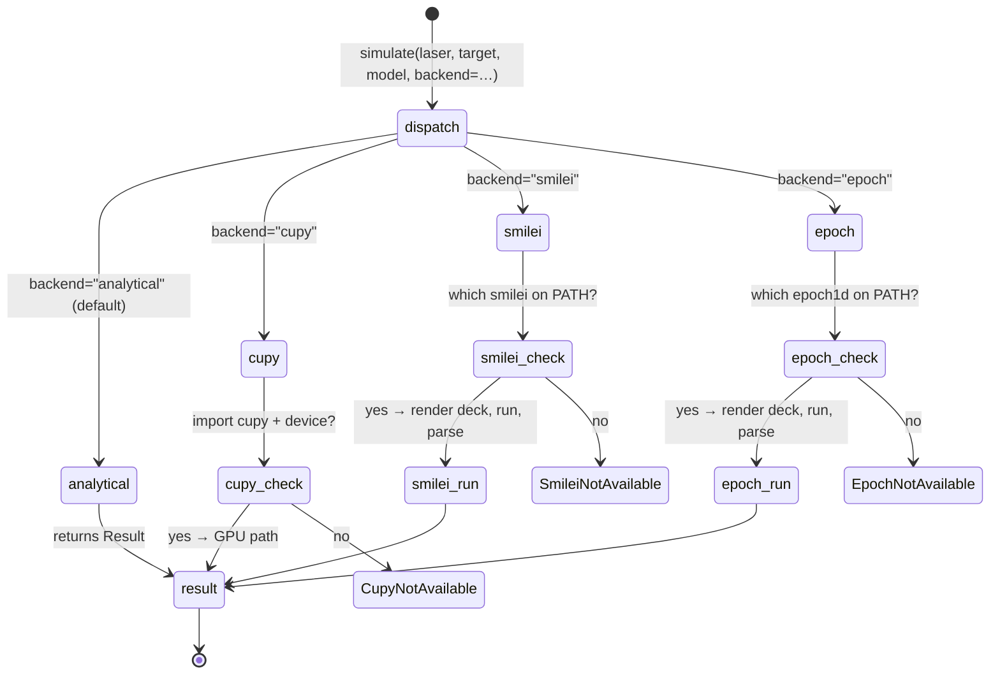

# Backends: analytical, SMILEI, EPOCH, CuPy




Every simulation is routed through a **backend**. The backend is responsible
for producing a `Result` given a `Laser`, `Target`, model name, and numerics
config. Three backends are shipped.

## `analytical` (default)

Dispatches to the in-process semi-analytical model chosen by `model:`. This
is the fast path — all five models run in a fraction of a second on a
laptop. Use it for:

- parameter sweeps where you want a dense grid;
- development and testing;
- pedagogical exploration;
- quick checks before committing to a PIC run.

No external dependencies beyond the library itself.

## `smilei`

Wraps the [SMILEI](https://smileipic.github.io/Smilei/) PIC code. The
adapter lives in
[`src/harmonyemissions/backends/smilei.py`](../src/harmonyemissions/backends/smilei.py).

### What it does

- Reads the `Laser`/`Target` and fills a templated 1D Cartesian SMILEI
  input deck (`input.py`).
- Spawns `smilei input.py` in a temp directory.
- Parses the resulting HDF5 field output back into the same `Result`
  shape every other backend returns.

### Prerequisites

- SMILEI compiled and the `smilei` executable on `$PATH`.
- HDF5 + h5py available in the Python environment (already a dependency
  of this package).

### Limitations (roadmap)

- Output parsing is currently a stub — the deck is generated and the run
  is launched, but `_parse_output` raises `NotImplementedError`. To
  complete the adapter, read the probe/field diagnostics via `h5py`
  (SMILEI writes them under `Fields*.h5`) and repackage them into the
  `Result` dataclass.
- Only the `rom` and `cse` surface-HHG models are wired through this
  backend today. Gas HHG and betatron would need their own input-deck
  templates.
- 1D geometry only; 2D/3D decks are a future extension.

## `epoch`

Wraps [EPOCH](https://cfsa-pmw.warwick.ac.uk/EPOCH) in the same shape as
the SMILEI adapter. EPOCH uses a Fortran-flavored `input.deck` and writes
SDF output files, so the render/parse layers differ.

### Prerequisites

- EPOCH's `epoch1d` binary on `$PATH`.
- Either the `sdf_helper` Python package or a separate SDF→HDF5 converter;
  the parser is currently a stub.

### Limitations

Same roadmap as SMILEI: the deck is generated and the process is
launched, but output parsing raises `NotImplementedError`. Fixing this is
the main gating item for PIC-backed surface HHG in Harmony of Emissions.

## Writing a new backend

The contract is minimal — implement a class that defines

```python
class MyBackend:
    name: str = "mine"

    def simulate(self, laser: Laser, target: Target, model: str, numerics) -> Result:
        ...
```

and register it in
[`src/harmonyemissions/backends/__init__.py`](../src/harmonyemissions/backends/__init__.py)
under a short key. Everything else — CLI, scan, plotting — will work
unchanged as long as the returned `Result` follows the schema in
[`models/base.py`](../src/harmonyemissions/models/base.py).
