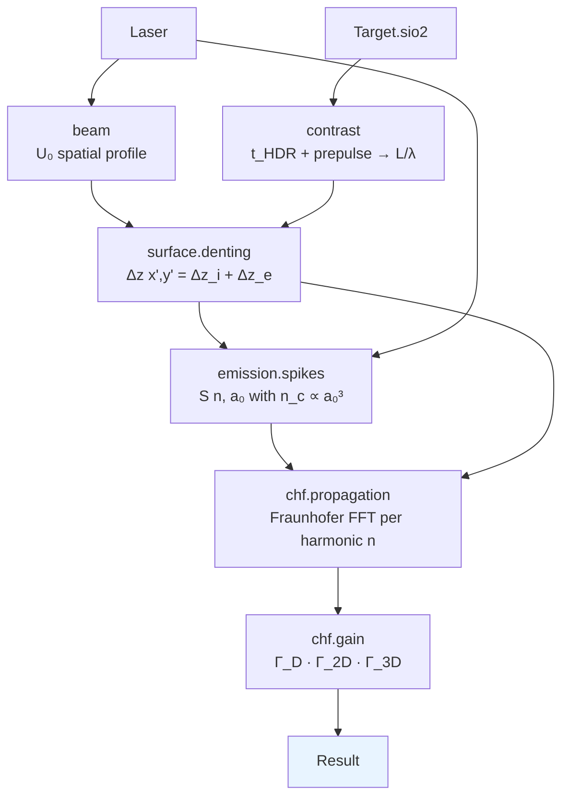
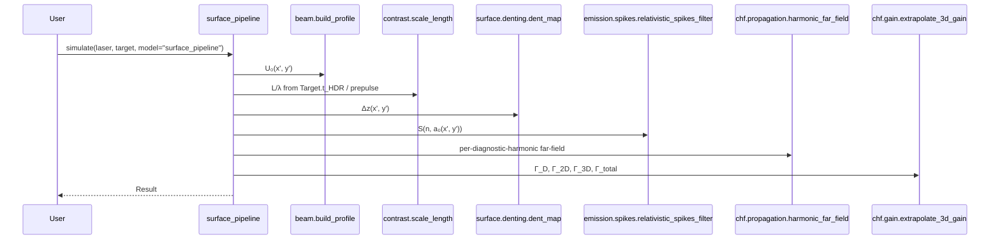

# Coherent Harmonic Focus (CHF)

Timmis et al., *Nature* (2026), DOI
[10.1038/s41586-026-10400-2](https://doi.org/10.1038/s41586-026-10400-2)
(the paper this library is directly modelled on) demonstrated the last
missing ingredient to turn surface high-harmonic generation (SHHG) into a
route to extreme electromagnetic fields: high conversion efficiency
concurrent with spatial curvature of the plasma surface, which together
permit a **Coherent Harmonic Focus (CHF)** — a spatiotemporally compressed
burst of reflected light whose peak intensity far exceeds the driver.

## The three ingredients

1. **High-order harmonics with diffraction-limited focusing.** The
   reflected nth harmonic has wavelength λ/n, so its diffraction-limited
   spot area is (λ/n)² — a factor of n² smaller than the driver.
2. **Phase locking (attosecond pulse train).** The harmonics are
   coherent relative to each other, so the reflected field is a train of
   attosecond-duration spikes.
3. **Slow efficiency decay (η_n ≈ n^(−8/3)).** Combined with the n² spot
   reduction this means the *field* strength per harmonic falls only as
   n^(−1/3), so adjacent orders contribute comparable energy to the
   final focus — the CHF.

Up to 2026 the first two ingredients were routinely demonstrated, but
the third had not been simultaneously achieved on PW-class facilities.
The Timmis experiment tuned the DPM contrast (t_HDR = 351 fs vs 711 fs)
to unlock it — observing 9.5 ± 4.9 mJ in harmonics 12–47 at 1.2 ×
10²¹ W/cm² (η = 0.17 ± 0.08 %).

## The library's CHF pipeline

`harmonyemissions.models.surface_pipeline.SurfacePipelineModel` implements
the paper's Methods § eqs. 7–12 as a five-stage pipeline:



Each stage is a standalone module with its own unit tests, so the
pipeline is composable and the individual pieces are easy to swap out
(e.g. replace the denting analytic model with a PIC-extracted dent map).

### What each stage calls



### What you get back


The four panels on a single Gemini run: the spatially-averaged harmonic
spectrum, the plasma dent map Δz/λ, the driver near-field intensity
|U₀|², and the CHF gain factors Γ_D, Γ_2D, Γ_3D, Γ_total.


*The 2-D plasma dent — deepest in the centre of the super-Gaussian focal
spot, out to ~Δz/λ ≈ 0.1–0.5 depending on a₀ and L.*


*Γ_D (temporal), Γ_2D (spatial), Γ_3D = Γ_2D² (3-D extrapolation), and
the product Γ_total on a log axis.*

## Running it

```bash
harmony chf configs/chf_gemini.yaml -o /tmp/gemini.h5
```

prints the full CHF gain breakdown and saves a `Result` HDF5 containing
the spectrum, 2-D dent map, driver and diagnostic-harmonic beam
profiles, and the gain dict.

From Python:

```python
from harmonyemissions import Laser, Target, simulate

laser = Laser(a0=24.0, duration_fs=50.0, spatial_profile="super_gaussian",
              spot_fwhm_um=2.0, super_gaussian_order=8, angle_deg=45.0)
target = Target.sio2(t_HDR_fs=351.0, prepulse_intensity_rel=1e-3,
                     prepulse_delay_fs=100.0)
r = simulate(laser, target, model="surface_pipeline")
r.chf_gain          # {'Gamma_D': ..., 'Gamma_2D': ..., 'Gamma_3D': ..., 'Gamma_total': ...}
```

## The a₀³ scaling law

`harmonyemissions.chf.gain.scaling_I_chf_over_I(a0)` returns the
I_CHF/I ratio anchored at the Gemini calibration point (a₀ = 24,
Γ ≳ 80 from the paper's Fig. 4a). Use it to extrapolate to future
multi-PW systems:

```python
from harmonyemissions.chf.gain import predict_chf_intensity
from harmonyemissions.units import a0_to_intensity

for name, a0 in [("Gemini", 24), ("ELI-NP 10 PW", 60), ("SEL 50 PW", 130)]:
    I_drive = a0_to_intensity(a0, 0.8)
    I_chf = predict_chf_intensity(I_drive, a0)
    print(f"{name}: I_CHF = {I_chf:.2e} W/cm²")
```

## Caveats and approximations

- **3D gain Γ_3D = Γ_2D²** is the axisymmetric approximation used by the
  paper to extrapolate from 2D PIC. For asymmetric beams or strongly
  multi-dimensional denting it is a lower bound.
- **Electron-excursion dent Δz_e** uses the Vincenti 2014 closed form as
  a placeholder — eq. 11 of the Timmis paper is the more detailed
  expression but its image in the PDF is partially cropped.
- **Spectrum** is the energy-weighted spatial average of the relativistic
  spikes filter. It reproduces the n^(−8/3) slope and the a₀³ cutoff but
  is not a self-consistent simulation of the phase-coherent reflection.
  For PIC-grounded spectra, use the SMILEI backend (output parsing is
  still a stub — see `backends.md`).
