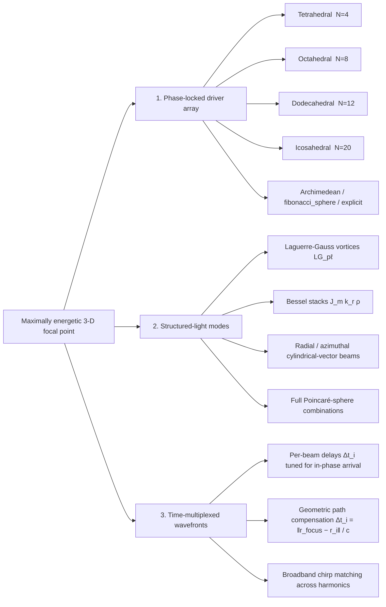
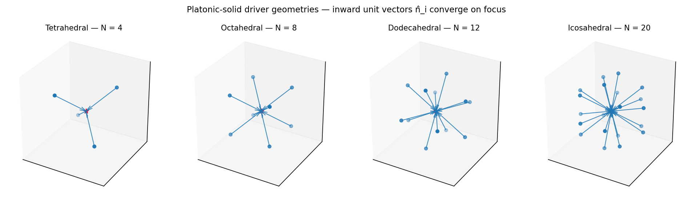
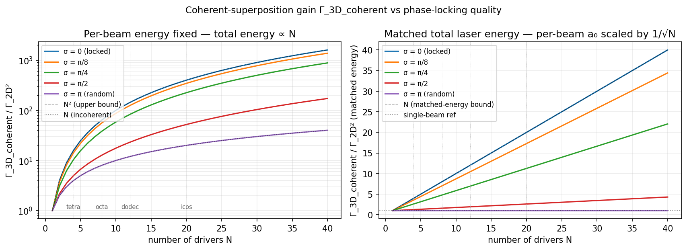
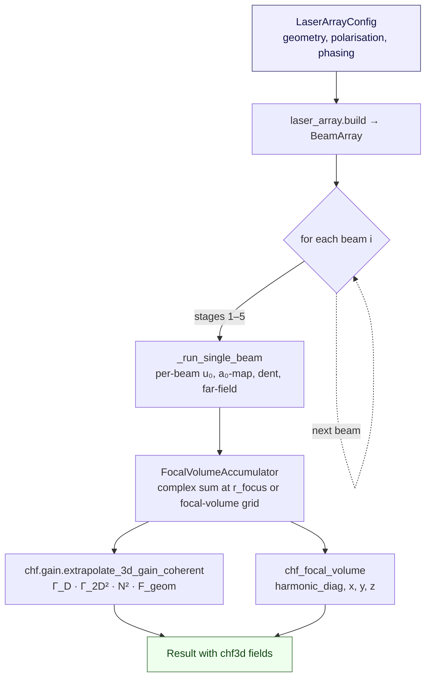

# 3-D Coherent Harmonic Focus (chf3d)

> **Status — in progress.** Phases A (schema + plumbing) and B (single-beam
> refactor) are merged; Phase C (physics kernel) and Phase D (viz, notebook,
> docs polish, iterative phase optimiser) are still in flight. The full
> implementation roadmap lives in
> [`/root/.claude/plans/explore-3d-implications-of-vast-firefly.md`](../../.claude/plans/explore-3d-implications-of-vast-firefly.md).

## Why 3-D

Today, the single-beam CHF pipeline ([`docs/chf.md`](chf.md)) extrapolates
from a 2-D PIC simulation to a 3-D peak intensity using the axisymmetric
approximation **Γ_3D ≈ Γ_2D²** — see
[`src/harmonyemissions/chf/gain.py:60`](../src/harmonyemissions/chf/gain.py#L60).
That is a *lower bound* for asymmetric spots and a *crude estimate* even
for axisymmetric ones; it cannot answer the actually interesting design
question:

> **If you have N coherent drivers, how do you arrange them in 3-D so
> the total field at the focal point is maximum?**

The answer touches three mostly-independent architecture families:



The three families compose: a dodecahedral array of Laguerre-Gauss
vortices fired with per-beam delays and per-beam polarization is a
single, valid `LaserArrayConfig` block.

## Geometry primitives



*Inward-pointing unit vectors n̂_i from the face centres of the four
larger platonic solids (the cube reduces to an octahedron-vertex set, so
it shares panels). Each arrow is a driver direction; the central red star
is the common focal point. The icosahedral N=20 set provides the
maximum-symmetry coverage of the focal sphere available within the
platonic family.*

The face- and vertex-counts:

| Geometry | Face count | Vertex count | Polytope dual |
|---|---|---|---|
| `tetrahedral`  |  4 |  4 | tetrahedron (self-dual) |
| `cubic`        |  6 |  8 | octahedron |
| `octahedral`   |  8 |  6 | cube |
| `dodecahedral` | 12 | 20 | icosahedron |
| `icosahedral`  | 20 | 12 | dodecahedron |

A `LaserArrayConfig.placement` of `"faces"` (default) uses face-centre
directions; `"vertices"` uses vertex directions — these are
geometrically distinct beam-counts for everything except the tetrahedron.

Beyond the platonics, the geometry primitive supports
`fibonacci_sphere` (any N), `ring` (any N, in-plane), `archimedean`
(cuboctahedron, truncated icosahedron, …), and `explicit` (provide a
`directions: list[(float, float, float)]` block directly for asymmetric
or experimentally-constrained arrays).

## The math

At each focal-volume voxel `r`:

```
E_3D(r, n) = Σ_i  w_i · A_i(n) · ε_i  ·  exp{ i [ k_n · n̂_i · (r − r_focus)
                                                + φ_i + ω_n · Δt_i ] }
```

with k_n = 2πn/λ, ω_n = 2πcn/λ. `A_i(n)` is the on-axis Fraunhofer
amplitude of beam *i* (interpolated from the existing 2-D far-field stack
that the single-beam pipeline already produces). Polarization is carried
as a length-3 complex Jones vector `ε_i`; the final intensity is the sum
of squared components, `|E_x|² + |E_y|² + |E_z|²`.

The closed-form **coherent gain law** for an N-beam array with optimally
phased drivers is

```
Γ_3D_coherent  =  N² · Γ_2D² · F_geom
```

where `F_geom ∈ (0, 1]` collects three penalty factors:

1. **Solid-angle coverage** — how well the N drivers tile the focal
   sphere (dodecahedral and icosahedral score near-unity; tetrahedral
   leaves large gaps).
2. **Polarization mismatch** — when ε_i are not all aligned at the
   focal point (e.g. radial polarization on a hemispherical cap),
   `F_geom` picks up a factor < 1.
3. **Sidelobe leakage** — energy outside the central focal voxel that
   the gain law does not credit toward the peak.

For N = 1, F_geom = 1 ⇒ Γ_3D = Γ_2D², which exactly reproduces the
legacy single-beam result.



*Left panel — fixed per-beam energy, total energy ∝ N. Coherent locking
(σ → 0) gives N² gain; random phasing (σ → π) gives only N. Right panel —
matched total laser energy with per-beam a₀ scaled by 1/√N. Coherent
locking still wins linearly with N; random phasing barely beats single-
beam. The dashed verticals mark the platonic counts.*

The interpolation between fully-locked and fully-random is captured by

```
⟨|Σ_i e^{iφ_i}|²⟩  ≈  N² · e^{−σ²}  +  N · (1 − e^{−σ²})
```

— so the **phase-locking quality σ is the dominant lever**: a residual
σ ≈ π/4 already sacrifices ~half the coherent gain on a 12-beam dodec.
The `chf/timing.py` module ships an analytic phase optimiser that solves
`φ_i* = −arg(A_i) − k_n · (r_i − r_focus) · n̂_i` exactly when the
pipeline can predict the per-beam complex amplitudes; iterative branches
(`scipy_lbfgs`, `gerchberg_saxton`) handle non-uniform driver weights.

## Time-multiplexed wavefront stacking

Per-beam phase at the focal point for harmonic *n*:

```
φ_i(n)  =  ω_n · Δt_i  +  k_n · (r_i − r_focus) · n̂_i  +  φ_i^static
```

The `ω_n · Δt_i` term is the temporal multiplex; setting
`Δt_i = ‖r_focus − r_i‖ / c` makes all wavefronts arrive simultaneously
at the focus — a closed-form result baked into
`chf.timing.geometric_delays`. Because the optimum is *wavelength-
dependent*, broadband attosecond bursts — which are intrinsically
chirped by the plasma denting — need a per-harmonic phase strategy.
This is precisely what makes 3-D CHF more demanding than just "aim N
drivers at a point."

## Pipeline integration

The chf3d path reuses the entire single-beam pipeline (six stages from
[`docs/chf.md`](chf.md)) per driver, then layers a **coherent-superposition
accumulator** on top:



Memory stays bounded at ~128 MB independent of N: beams are streamed
sequentially through `_run_single_beam`, each contribution is added to
the complex accumulator, and the per-beam buffer is then released.
Only a small focal-volume cube (default 32³ voxels of 16 B each → 1 MB
per diagnostic harmonic) is held permanently. The harmonic-chunk cap
inside the per-beam pipeline (`16_000_000 // grid_size`) is preserved
verbatim — see the chunked broadcast in `models/surface_pipeline.py`.

The single-beam path is bit-for-bit unchanged: when `laser_array` is
absent from the config, the runner takes the legacy branch and calls
`extrapolate_3d_gain` (Γ_3D = Γ_2D²) exactly as today.

## Configuration

A minimal dodecahedral `laser_array` block:

```yaml
model: surface_pipeline
backend: analytical
laser:
  a0: 24.0
  wavelength_um: 0.8
  duration_fs: 30.0
  spatial_profile: super_gaussian
  spot_fwhm_um: 2.0
  super_gaussian_order: 8
target:
  kind: overdense
  material: SiO2
  t_HDR_fs: 351.0
  prepulse_intensity_rel: 1.0e-3
  prepulse_delay_fs: 100.0
laser_array:
  geometry: dodecahedral       # 12 face centres
  placement: faces
  polarization_mode: radial    # ε_i pointed inward in each beam's transverse plane
  # relative_phase_rad: [...]  # optional — analytic optimiser computes when omitted
  # relative_delay_fs: [...]   # optional — geometric_delays computed when omitted
  # per_beam_a0_scale: [0.289]*12   # 1/√12 ≈ 0.289 → matched-energy mode
numerics:
  pipeline_grid: 128
  chf_focal_volume_n: 32
  chf_focal_volume_extent_um: 1.0
  chf_focal_volume_mode: volume   # or "point" for a fast on-axis-only sum
  store_per_beam_far_field: false  # true → store all 12 beams' 2-D far-fields too
  phase_optimiser: analytic       # or scipy_lbfgs / gerchberg_saxton (Phase D)
```

The full Pydantic schema (with all validation rules) lives in
[`src/harmonyemissions/config.py`](../src/harmonyemissions/config.py); a
companion full-list of supported geometries, polarization modes, and
structured-light modes is reproduced below.

| Field | Allowed values | Notes |
|---|---|---|
| `geometry` | `tetrahedral`, `cubic`, `octahedral`, `dodecahedral`, `icosahedral`, `ring`, `fibonacci_sphere`, `explicit` | Platonic counts are fixed; `ring` / `fibonacci_sphere` need `n_beams`; `explicit` needs `directions` |
| `placement` | `faces` (default), `vertices` | Only meaningful for the platonic geometries |
| `polarization_mode` | `uniform_p`, `uniform_s`, `radial`, `azimuthal`, `circular_alternating`, `explicit` | `explicit` requires `polarization_vectors` of length N |
| `structured_mode` | `lg`, `bessel`, `radial`, `azimuthal`, *omit* | When set, each beam uses the structured profile instead of the laser's default `spatial_profile` |
| `per_beam_a0_scale` | length-N list of floats | Sum-of-squares ≤ 1 enforced (total-power conservation) |

## Status and verification

Phase A (schema + plumbing) and Phase B (single-beam refactor) are
landed; the full test suite stays green at every commit:

```bash
pytest -q --ignore=tests/benchmarks      # 325 passed, 2 skipped
harmony validate configs/chf3d_dodecahedral.yaml
# OK — surface_pipeline on overdense via analytical
#   laser_array: geometry=dodecahedral placement=faces n_beams=12 polarization=radial
```

The `Result` schema has already grown three reserved fields —
`chf_focal_volume`, `per_beam_far_field`, `beam_array_geometry` — and old
HDF5 files round-trip cleanly with all three set to `None`. New runs
populate them when `laser_array` is present.

Round-trip verification matrix:

| scenario | spectrum | dent_map | beam_profile_far | chf_focal_volume | per_beam_far_field | chf_gain keys | beam_array_geometry |
|---|---|---|---|---|---|---|---|
| legacy single-beam | ✓ | ✓ | ✓ | None | None | 4 | None |
| `laser_array.n_beams = 1` | ✓ | ✓ | ✓ | optional | optional | 4 + 5 new | dict |
| dodec, no per-beam | ✓ | ✓ | ✓ | ✓ | None | 4 + 5 new | dict |
| icos, per-beam on | ✓ | ✓ | ✓ | ✓ | ✓ (20 × 4 × N × N) | 4 + 5 new | dict |
| reload of pre-chf3d HDF5 | ✓ | ✓ | ✓ | None | None | 4 | None |

## Roadmap

| Phase | Status | Scope |
|---|---|---|
| **A** | ✅ Done | `LaserArrayConfig` schema, `NumericsConfig` chf3d knobs, `Result` schema growth, `to_dataset` / `load` round-trip, runner gate, CLI `validate` extension. 22 new tests in `tests/test_laser_array.py`, 3 in `tests/test_io.py`, 325 total passing. |
| **B** | ✅ Done | Pure refactor: extracted `_run_single_beam` from `models/surface_pipeline.py` (zero behavioural change). |
| **C** | 🚧 In progress | New modules `chf/geometry.py`, `chf/superposition.py`, `chf/timing.py`. New `beam/modes.py` for structured-light. `LaserArrayConfig.build()` materialiser. Multi-beam dispatch in `surface_pipeline.run`. Configs `chf3d_dodecahedral.yaml`, `chf3d_icosahedral.yaml`, `chf3d_structured_vortex.yaml`. End-to-end multi-beam tests. |
| **D** | ⏳ Planned | `viz.plot_focal_volume`, `viz.plot_beam_array`, per-beam phase residual bars, `harmony plot -k focal-volume`/`-k array`, `examples/12_chf3d.ipynb`, `scipy_lbfgs` / `gerchberg_saxton` iterative optimiser branches, `make images` regeneration. |

The full plan with file-by-file anchors is at
[`/root/.claude/plans/explore-3d-implications-of-vast-firefly.md`](../../.claude/plans/explore-3d-implications-of-vast-firefly.md).

## Caveats and open questions

- **Single-plasma vs N-plasma geometry.** The math above assumes each driver
  hits its own locally-flat overdense plasma at near-normal incidence; the
  reflected harmonics then propagate inward to the common focus. For
  experimentally-realistic asymmetric plasma curvatures or shared central
  plasmas, the per-beam single-beam pipeline still applies but the geometry
  factor F_geom acquires additional terms not captured by the closed-form
  N²·Γ_2D² limit.
- **Phase noise from non-shared driver lines.** If the N drivers are not
  derived from a common oscillator (e.g. independent OPCPA front-ends), the
  σ in the gain-vs-locking-quality plot is set by the cross-line phase
  noise, not by the user. The library models this through `relative_phase_rad`
  but does not predict it from first principles.
- **3-D PIC fidelity.** The analytical chf3d path is intentionally an
  upper-bound estimator. Calibration against a 3-D SMILEI run is a Phase E
  follow-up — `tests/test_smilei_deck.py` is the contract that pins SMILEI
  parameters to the paper.
- **dodec ≷ icos at matched energy?** This is a real physics question that
  depends on F_geom for each geometry; the analytic gain formula gives
  `N · e^{−σ²} + (1 − e^{−σ²})` for matched-energy in-phase drivers, so
  icosahedral (N=20) wins by exactly a 5/3 ratio over dodecahedral (N=12)
  in the σ → 0 limit. The corresponding `pytest.mark.xfail` test is held
  in reserve until F_geom is calibrated against PIC.

## Related reading

- [`docs/overview.md`](overview.md) — full project capabilities and architecture.
- [`docs/chf.md`](chf.md) — the underlying single-beam CHF pipeline.
- [`docs/theory.md`](theory.md) — physics derivations including the spikes
  filter `S(n, a₀)` and the Timmis denting model.
- [`docs/comparison.md`](comparison.md) — how surface HHG sits relative to
  every other emission regime in the library.
- [`CLAUDE.md`](../CLAUDE.md) — architecture invariants. The 3-D extension
  is additive: every new field defaults to `None`, every new gain dict key
  is added without removing old ones, every new config field defaults to
  absent.
