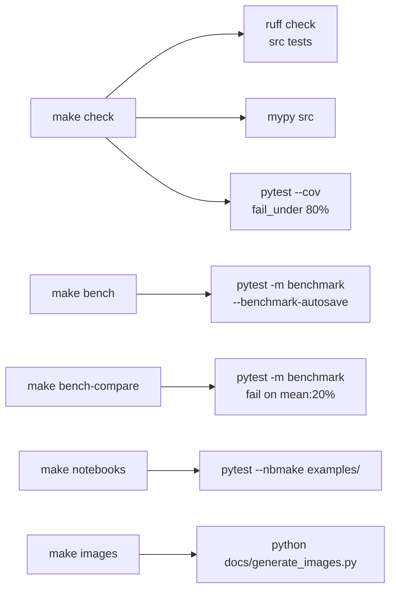

# CI / local quality gates

This project ships a :file:`Makefile` with every gate needed to keep the
code honest. All of them run on the CPU, with no CUDA/MPI runtime
required.



## Quick cheat sheet

```bash
make test          # unit + property-based suite (fast)
make bench         # pytest-benchmark, autosaves baseline
make bench-compare # fail-on ≥ 20 % mean regression
make lint          # ruff check src tests
make type          # mypy src
make cov           # pytest with coverage (fail_under = 80 %)
make check         # lint + type + cov — use this in CI
make notebooks     # pytest --nbmake examples/
make images        # regenerate docs/images/*.png from the library
make docs          # alias for `make images` (placeholder for a future site)
```

## Optional-extra install matrix

| Goal                       | Command                                   |
|----------------------------|-------------------------------------------|
| CPU accel (numba + pyfftw) | `pip install -e ".[accel]"`               |
| Dev tools (pytest, …)      | `pip install -e ".[dev]"`                 |
| GPU path (requires CUDA)   | `pip install -e ".[gpu]"`                 |
| MPI path                   | `pip install -e ".[mpi]"`                 |
| Everything                 | `pip install -e ".[all,dev]"`             |

## Marker tiers

Tests are grouped by runtime tier:

| Marker       | How to run                                          |
|--------------|-----------------------------------------------------|
| (default)    | `pytest`                                            |
| `slow`       | `pytest -m slow`                                    |
| `gpu`        | `HARMONY_TEST_CUPY=1 pytest -m gpu`                 |
| `mpi`        | `HARMONY_TEST_MPI=1 mpirun -n 2 pytest -m mpi`      |
| `benchmark`  | `pytest -m benchmark --benchmark-only`              |

The default `pytest` invocation skips all of them via the
`addopts = "-m 'not slow and not gpu and not mpi and not benchmark'"`
setting in :file:`pyproject.toml`.

## Coverage thresholds

`make cov` runs the suite under `pytest-cov`, emits HTML and XML
reports, and fails the build when coverage dips below 80 % (configured
in `pyproject.toml`'s `[tool.coverage.report]`). Modules that depend on
optional runtimes (SMILEI / EPOCH / CuPy / mpi4py) are excluded so the
metric reflects code that actually runs on CI.

## Lint and type-check

- `ruff check src tests` enforces import sorting, pyupgrade, and
  flake8-bugbear. Configured in `[tool.ruff.lint]`.
- `mypy src` runs in the strict-optional mode with
  `ignore_missing_imports = true` for cupy / mpi4py / pyfftw / numba.

## Wiring into GitHub Actions / GitLab CI / Jenkins

Because the repo isn't tied to a specific CI provider, we ship just
the `Makefile` target. Use:

```yaml
# GitHub Actions (illustrative)
- run: pip install -e ".[dev,accel]"
- run: make check          # lint + type + cov
- run: make bench-compare  # fail-on perf regression
- run: make notebooks      # nbmake
```

or any equivalent for your provider.
