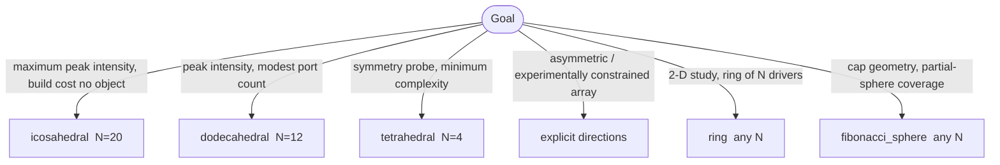

# Combined emission power across geometric configurations

> **What this doc is.** A primer + reference for *how emission power adds*
> when more than one source is at play — either many phase-locked drivers
> arranged in a 3-D geometry (coherent), or many independent targets in a
> single facility shot (incoherent across regimes). It pairs with
> [`examples/12_combined_power_geometries.ipynb`](../examples/12_combined_power_geometries.ipynb)
> as the runnable counterpart.

## Why "combined" needs disambiguation

Two completely different things can hide under the word "combined":

```mermaid
flowchart LR
    Q[I want more photons]
    Q --> A[1. Coherent within-regime<br/>N phase-locked drivers, same target type]
    Q --> B[2. Incoherent across regimes<br/>N independent targets, one facility shot]

    A --> AM[|Σ_i E_i|² @ focal point<br/>~ N²·F_geom·Γ_2D²]
    B --> BM[Σ_i |E_i|² per keV bin<br/>= Σ_i η_i · I_i]

    AM --> AR[peaks the *intensity* at one point in 3-D]
    BM --> BR[fills out *coverage* across the keV / γ axis]

    classDef left  fill:#dde,stroke:#447,color:#114
    classDef right fill:#ded,stroke:#474,color:#141
    class AM,AR left
    class BM,BR right
```

Both routes produce "more photons", but they answer different questions
and obey different scaling laws. Picking the wrong one for the wrong goal
is a common source-design mistake.

## Coherent within-regime — geometry × phase-locking

When N drivers fire phase-locked at a common focal point — the chf3d
direction documented in [`docs/chf3d.md`](chf3d.md) — the focal-volume
intensity scales as

```
Γ_3D_coherent  =  N² · Γ_2D² · F_geom         (fixed per-beam energy)
                =  N · Γ_2D² · F_geom         (matched total energy)
```

with `F_geom ∈ (0, 1]` capturing solid-angle coverage, polarization
mismatch, and sidelobe leakage of the chosen geometry. With phase
jitter σ (RMS, radians), the closed-form

```
⟨gain⟩  ≈  N · e^{−σ²}  +  (1 − e^{−σ²})       (matched total energy)
```

interpolates between fully-locked (gain = N) and fully-random (gain ≈ 1,
no better than single-beam).


*Matched-total-energy gain factors over the single-beam baseline. The
heatmap on the left is the same data as the grouped bars on the right.
At σ = 0 the icosahedral N=20 array buys 20× peak intensity; at σ = π/4
that drops to 11×; at σ = π/2 the entire benefit collapses to ~3×
regardless of geometry. **Phase-locking quality is the dominant lever.***

A summary table at σ = 0:

| Geometry | N | Γ_3D_coherent / Γ_2D² (matched energy) | vs Tetra |
|---|---|---|---|
| Tetrahedral  |  4 |  4×  | 1.00× |
| Cubic        |  6 |  6×  | 1.50× |
| Octahedral   |  8 |  8×  | 2.00× |
| Dodecahedral | 12 | 12×  | 3.00× |
| Icosahedral  | 20 | 20×  | 5.00× |

The ranking is monotone in N — but real arrays are constrained by
beam-port geometry, vacuum-vessel access, and target-fabrication. A
6-port octahedral chamber is far more buildable than a 20-port
icosahedral one; an 8-port octahedron-vertex configuration shares the
12-port dodecahedron's gain budget at half the engineering cost.

### Decision tree — which geometry?



All five end up in the same `LaserArrayConfig` block — the
[Phase A schema](chf3d.md#configuration) accepts every geometry today;
the multi-beam pipeline (Phase C) ingests them once it lands.

## Incoherent across regimes — facility design

A single laser shot can illuminate several targets simultaneously: an
overdense plasma producing surface harmonics, a gas jet doing Lewenstein
HHG, a separate underdense channel for LWFA betatron, and a high-Z foil
for hot-electron bremsstrahlung. Photons emitted from each target reach
the detector independently — they add **incoherently** per keV bin.

The library has every primitive you need:

1. Each `Result.spectrum` already carries a `photon_energy_keV` coord.
2. Convert each spectrum to absolute photon flux using a per-regime
   conversion efficiency `η_i` (literature-anchored; the notebook
   exposes them as overridable knobs).
3. Interpolate every contribution onto a common log-spaced energy axis.
4. Sum.

Representative `η_i` (from the notebook, override at will):

| Regime | η (per shot, dimensionless) | Where it peaks |
|---|---|---|
| `surface_pipeline` (plateau) | ~1.5 × 10⁻³ | XUV → keV |
| `cwe`                         | ~1.0 × 10⁻⁴ | XUV |
| `lewenstein` (Ar plateau)     | ~3.0 × 10⁻⁵ | XUV |
| `bremsstrahlung` (hot electron) | ~2.0 × 10⁻⁴ | hard X → γ |
| `kalpha` (mid-Z)              | ~1.0 × 10⁻⁵ | element-pinned line |
| `betatron` (LWFA, photons / driver photon) | ~5.0 × 10⁻⁵ | keV → MeV |
| `ics` (Compton, photons / electron) | ~1.0 × 10⁻⁹ | MeV |


*A representative facility shot: 4 surface-pipeline drivers (incoherent
yield bookkeeping at the detector), 1 gas HHG jet, 1 LWFA betatron,
1 Cu-Kα target, 1 bremsstrahlung target. Left — stacked-area photon flux
per eV bin (log axes); the four bands (XUV / soft-X / hard-X / γ) are
shaded behind. Right — integrated yield in each band as a
stacked bar, showing which source dominates which band.*

The picture answers a class of facility questions cleanly:

- **"Where is my XUV signal coming from?"** Mostly surface_pipeline +
  gas; everything else is sub-dominant.
- **"What dominates my γ band?"** Bremsstrahlung bulk continuum, with
  betatron contributing a soft-γ shoulder.
- **"If I want more soft X photons, do I need a surface array or a
  bremsstrahlung target?"** Read off the soft-X column of the right
  panel; the answer depends on the relative `η_i` you choose.

## Worked examples

### Coherent gain — Gemini-class dodec

Gemini single-beam (a₀ = 24, t_HDR = 351 fs) anchors at Γ_total ≈ 80
([Timmis 2026 Fig. 4 anchor](chf.md), `scaling_I_chf_over_I(24.0)`).
Project to a 12-driver dodecahedral array under matched total energy at
σ = π/8:

```python
from harmonyemissions.chf.gain import scaling_I_chf_over_I
import numpy as np

N = 12
sigma = np.pi / 8
gain_dodec = N * np.exp(-sigma**2) + (1.0 - np.exp(-sigma**2))   # ≈ 10.4
gain_total = scaling_I_chf_over_I(24.0) * gain_dodec             # ≈ 833
print(f"Projected I_CHF/I_driver ≈ {gain_total:.0f}×")
```

A 1.2 × 10²¹ W/cm² Gemini driver pushes a single-beam CHF to ~1 × 10²³;
the dodecahedral projection at modest σ = π/8 gives ~1 × 10²⁴ —
a factor-of-10 step toward the Schwinger limit. The same calculation
shows that *poor* phase-locking (σ ≈ π/2) collapses the entire benefit:
gain becomes ~1.9× single-beam, not 12×.

### Incoherent stack — soft-X yield at a multi-target facility

```python
from harmonyemissions import Laser, Target, simulate

shots = {
    "surface_pipeline": (
        simulate(Laser(a0=24.0), Target.sio2(t_HDR_fs=351.0),
                 model="surface_pipeline"),
        4,                       # four drivers, each fires at one target
        1.5e-3,
    ),
    "lewenstein": (
        simulate(Laser(a0=0.05), Target.gas(species="Ar"), model="lewenstein"),
        1, 3.0e-5,
    ),
    "bremsstrahlung": (
        simulate(Laser(a0=5.0), Target.overdense(100.0, 0.05), model="bremsstrahlung"),
        1, 2.0e-4,
    ),
}

# Total photon yield in the soft-X band (1 - 10 keV):
import numpy as np
total = 0.0
for name, (r, count, eta) in shots.items():
    E_keV = r.spectrum.coords["photon_energy_keV"].values
    S = r.spectrum.values
    mask = (E_keV > 1.0) & (E_keV < 10.0)
    if mask.sum() > 1:
        total += count * eta * float(np.trapezoid(S[mask], E_keV[mask]))
print(f"soft-X yield (arb.) = {total:.3e}")
```

Adjust `count` and `eta` per facility. Switch any target out (e.g. swap
the 1× bremsstrahlung for a 1× kalpha on a Cu foil) and the total
re-balances toward the new spectral peak.

## When does each route win?

| Goal | More drivers (coherent) | More targets (incoherent) | Change regime | Raise a₀ |
|---|---|---|---|---|
| Peak intensity at a single 3-D point | **best** (∝ N) | irrelevant | tune to surface_pipeline | ∝ a₀³ for CHF |
| Total photon yield in one keV band | sub-linear (∝ N) | linear in target count | best match to band | exponential cutoff shift |
| Spectral coverage (XUV → γ) | none — same band | **best** (orthogonal regimes) | fundamental | partial — extends own cutoff |
| Specific narrow line (e.g. Cu-Kα 8 keV) | none | add a Cu kalpha target | switch to `kalpha` | mild |
| Polarization control / vector field | radial / azimuthal arrays | structured-light beam | regimes vary | none |

The decision matrix in [`docs/comparison.md`](comparison.md) covers
"which single regime to pick"; this one covers "how to combine once you
have your regime(s) chosen."

## Caveats

- **F_geom is an upper bound** until calibrated against 3-D PIC. The
  closed-form `N²·F_geom·Γ_2D²` formula gives the best-case scaling;
  Phase-E PIC calibration will replace `F_geom = 1` with geometry-
  specific factors typically in the 0.3–0.9 range.
- **Conversion efficiencies are nominal.** The η values in the
  cross-regime table are literature-anchored representatives, not the
  output of a per-shot energy-balance calculation. The notebook treats
  them as user knobs precisely because real facility numbers vary
  ~10× between configurations.
- **Phase-locking budget is hardware-dependent.** σ in the gain matrix
  is set by your laser plant, not by anything the library computes.
  A common-oscillator OPCPA front-end gives σ ≪ π/8; independent
  amplifier chains routinely sit at σ ~ π/4 or worse.
- **The incoherent stack assumes detector-band orthogonality.** Two
  sources contributing to the *same* keV bin will interfere if the
  detector resolves the time-coincidence; the per-eV bookkeeping above
  is an integrated-energy framing, not an instantaneous-flux one.

## Related reading

- [`docs/chf3d.md`](chf3d.md) — the full chf3d feature: kernel design,
  geometry primitives, per-beam phase math, multi-beam pipeline.
- [`docs/chf.md`](chf.md) — single-beam Coherent Harmonic Focus (the
  `Γ_2D²` baseline that everything else multiplies).
- [`docs/comparison.md`](comparison.md) — every regime on one keV axis
  with the per-source decision matrix.
- [`docs/overview.md`](overview.md) — full project tour, including the
  capability matrix and architecture diagrams.
- [`examples/12_combined_power_geometries.ipynb`](../examples/12_combined_power_geometries.ipynb)
  — runnable counterpart to this doc, both chapters end-to-end.
