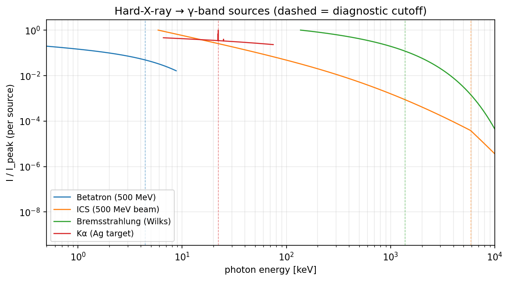
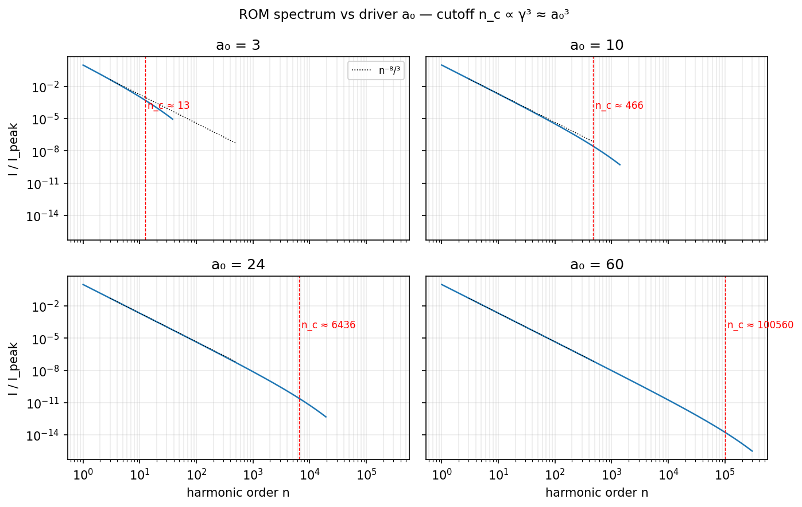
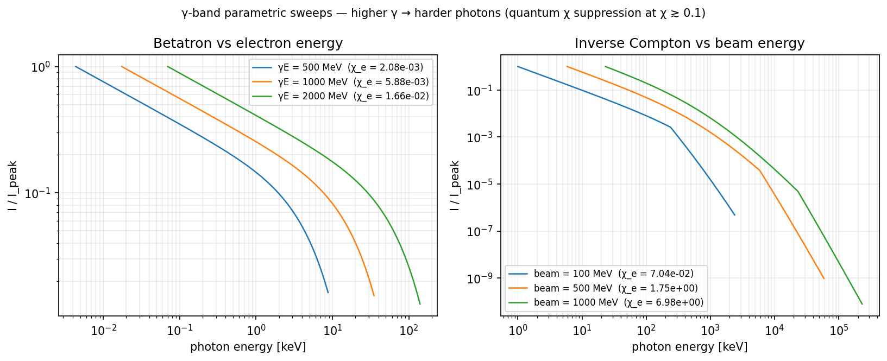
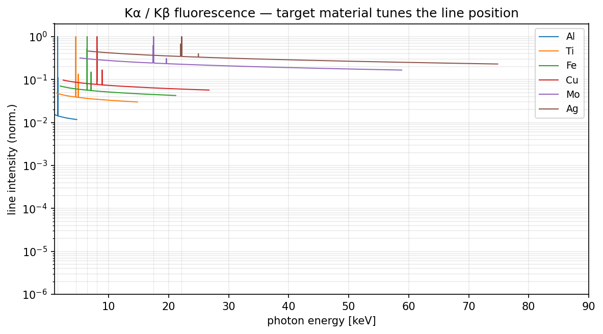

# Frequency-domain source comparison

Every emission model in Harmony of Emissions, on one page. Reads top to
bottom: (1) which source covers which photon band, (2) overlays at
matched drive conditions, (3) parametric sweeps collapsing onto
universal scalings, (4) a decision matrix for picking the right source.

All figures are rendered by `docs/generate_images.py`. Re-run
`make images` after any physics change.

## Photon-energy coverage

```mermaid
gantt
    title Emission source bands (log photon energy, eV)
    dateFormat  X
    axisFormat  %s

    section Surface HHG (coherent)
    rom / bgp / cse / cwe / surface_pipeline  : 0.5, 1e3

    section Gas HHG
    lewenstein                                 : 5, 300

    section Hard X-ray
    kalpha (Kα of light → mid-Z)               : 1e3, 3e4
    bremsstrahlung (hot-electron continuum)    : 1e3, 1e6
    betatron (LWFA synchrotron)                : 1e3, 3e5

    section Gamma
    ics (inverse Compton)                      : 1e5, 1e7
    bremsstrahlung (GeV converter, Bethe–Heitler)  : 1e5, 1e7
```

## Cross-source overlay


Every model, normalised to its own peak so the relative spectral *shape*
is visible at a glance. Reading guide: XUV-ish lines on the left (rom /
bgp / cse / cwe / lewenstein), Kα line spike in the middle at a few keV
(material-tunable), betatron and hot-electron bremsstrahlung in the
10 keV – 1 MeV block, ICS reaching 10 MeV when the electron beam is
ultra-relativistic.

## Surface-HHG regimes side-by-side


Same driver (a₀ = 10, 800 nm, overdense silica-like plasma), four
different spectral envelopes:

- **rom / bgp** — the BGP universal `I(n) ∝ n^(−8/3)` plateau. Use
  whenever the gradient is well-characterised and the driver has
  enough coherence length to build a Doppler-mirror response.
- **cse** — the shallower `n^(−4/3)` synchrotron nanobunch regime.
  Kicks in at ultra-short pre-plasma gradients (L/λ ≲ 0.02) and high
  a₀ (≳ 10).
- **cwe** — coherent wake emission at sub-relativistic a₀ (≲ 1). Cutoff
  sits at the plasma harmonic `n_p = √(n_e/n_c)`, **independent of a₀**.
- **surface_pipeline** — the Timmis 2026 pipeline that composes BGP
  scaling with 2-D denting and CHF focusing; consumes the same a₀ but
  returns a `Result` carrying dent maps and CHF gain factors, not just
  a spectrum.

The dotted black rulers are the two universal slopes; every surface
plateau should fall between them.

## Hard-X-ray → γ sources



All four gamma-band models at matched electron energy (500 MeV beam
where applicable, 800 keV hot-electron temperature otherwise). Dashed
verticals mark each source's dominant cutoff diagnostic. Table:

| Source             | Characteristic scaling                           | Typical brightness proxy   |
|--------------------|--------------------------------------------------|----------------------------|
| `betatron`         | ω_c ∝ γ³ · ω_β² · r_β / c                        | 10⁹ ph / 0.1 %BW           |
| `ics`              | E_γ = 4 γ² ħω_L / (1 + 4 γ ħω_L / m_e c²)        | 10⁸ ph / 0.1 %BW           |
| `bremsstrahlung`   | dI/dE ∝ E₁(E / T_hot)  (Wilks T_hot scaling)     | 10⁶ – 10⁷ ph / 0.1 %BW     |
| `kalpha`           | discrete line at fixed Z                         | 10⁹ ph / line / shot       |

(Order-of-magnitude figures; depend heavily on laser / target.)

## Parametric sweeps

### Varying a₀ — ROM



Cutoff harmonic tracks `n_c ∝ γ³ ≈ a₀³`; the −8/3 ruler makes the
universality visible. Going from a₀=3 to a₀=60 pushes the cutoff up
by four decades.

### Varying γ — betatron and ICS



Higher beam energy moves the cutoff right on both panels. The χ_e
annotations tell you when radiation reaction starts to bite: χ_e ≲ 0.1
is classical, χ_e ~ 1 clips the spectrum at ~30 % of the classical
prediction, χ_e ≫ 1 is the Ritus strong-field regime.

### Varying target material — Kα



Kα position is entirely set by the target's K-binding (Z²-ish, pins
characteristic-line energies) — swap material, swap line. The Kα / Kβ
branching ratio stays close to 0.13 across the sampled materials.

## Which source should I pick?

| Experiment                              | Coherent? | Monoenergetic? | Attosecond-scale? | Recommended model                 |
|-----------------------------------------|-----------|-----------------|--------------------|-----------------------------------|
| Attosecond XUV pulses (< 200 eV)        | ✓         | ✗ (broadband)   | ✓                  | `rom`, `bgp`, or `surface_pipeline` if CHF matters |
| XUV plateau from gas jets (10–100 eV)   | ✓         | ✗               | ✓                  | `lewenstein`                      |
| Sub-relativistic HHG (pre-PW drivers)   | ✓         | ✗               | partial            | `cwe`                             |
| Coherent focus toward QED regime        | ✓         | ✗               | ✓                  | `surface_pipeline`                |
| Broadband keV X-rays, LWFA-driven       | ✗         | ✗               | ✗                  | `betatron`                        |
| Tunable hard-X-ray characteristic line  | ✗         | ✓ (line)        | ✗                  | `kalpha`                          |
| MeV γ-rays, ultra-relativistic beam     | ✗         | partial         | ✗                  | `ics`                             |
| Broadband γ-rays from thick converter   | ✗         | ✗               | ✗                  | `bremsstrahlung` (+ Bethe–Heitler converter option in `gamma.bremsstrahlung`) |

Cross-references:

- [`theory.md`](theory.md) — full physics derivation for each row.
- [`gallery.md`](gallery.md) — single-source deep-dive PNGs.
- [`hard_xray.md`](hard_xray.md) — keV → MeV detector pipeline, needed
  to compare simulated spectra against real measurements.
- [`../examples/11_source_comparison.ipynb`](../examples/11_source_comparison.ipynb)
  — interactive notebook with the overlay helpers used to produce every
  PNG above; tweak the knobs and re-render live.
