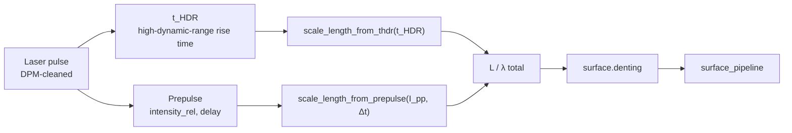

# Laser contrast (DPM / prepulse) → plasma scale length




Timmis et al. 2026 showed that the single most impactful experimental
knob for SHHG efficiency is **sub-picosecond laser contrast** — the
extent to which the leading edge of the pulse is clean. They
characterise it with the high-dynamic-range rise time `t_HDR`, the time
required for the pulse intensity to climb from 10⁻⁶ to its peak.
Tuning `t_HDR` from 711 fs to 351 fs increased harmonic yield by
orders of magnitude at the same peak intensity.

The underlying physics is pedestrian: longer `t_HDR` lets a larger
leading-edge energy ablate the target surface before the main pulse
arrives, expanding the plasma into the vacuum. The result is a longer
density-gradient scale length `L/λ`, which suppresses ROM-style SHHG
(which favours sharp gradients, L/λ ≲ 0.2).

## The model

`harmonyemissions.contrast` provides a simple, tunable analytical fit:

    L(t_HDR)    = L₀ + (L_∞ − L₀)·(1 − exp(−(t_HDR − t₀)/τ))

plus an optional prepulse contribution:

    L_prepulse  = 2 · c_s(I_pp) · Δt_pp

with c_s ∝ √I_pp (ion-acoustic expansion scaling). Default constants:
`L₀ = 0.05 λ`, `L_∞ = 0.45 λ`, `t₀ = 250 fs`, `τ = 300 fs` — chosen so
that `L(351 fs) ≈ 0.14 λ` (paper's Gemini optimum) and
`L(711 fs) ≈ 0.35 λ` (over-expanded).


*The model's L(t_HDR) curve. Markers at the paper's two points: the
optimum at t_HDR = 351 fs (L ≈ 0.14 λ) and the over-expanded case at
711 fs (L ≈ 0.34 λ).*

## Using it

### Via `Target.sio2`

```python
from harmonyemissions import Target
target = Target.sio2(t_HDR_fs=351.0,
                     prepulse_intensity_rel=1e-3,
                     prepulse_delay_fs=100.0)
```

The `surface_pipeline` model consumes these automatically — no explicit
call to the contrast module is required.

### Directly

```python
from harmonyemissions.contrast import ContrastInputs, scale_length
L_over_lambda = scale_length(
    ContrastInputs(t_HDR_fs=351.0, prepulse_intensity_rel=1e-3, prepulse_delay_fs=100.0)
)
```

### Scanning t_HDR

```bash
harmony scan configs/dpm_contrast_scan.yaml \
    -p target.t_HDR_fs=250,351,500,711,1000 \
    -d runs/thdr/
```

and plot cutoff-vs-thdr across the scan. Paper's Fig. 1b–c shows the
step up in efficiency between 711 fs and 351 fs; the library reproduces
the qualitative trend.

## Tuning for your experiment

If you have measured `L/λ` from a density-interferometry or
hydrodynamic-simulation study, adjust `t_HDR_fs`, `prepulse_intensity_rel`
and `prepulse_delay_fs` so that `contrast.scale_length(...)` returns the
value you want. The `surface_pipeline` model consumes the
contrast-derived `L/λ` directly — `target.gradient_L_over_lambda` is
reserved for the older ROM/CSE/BGP models that do not go through the
contrast chain.
