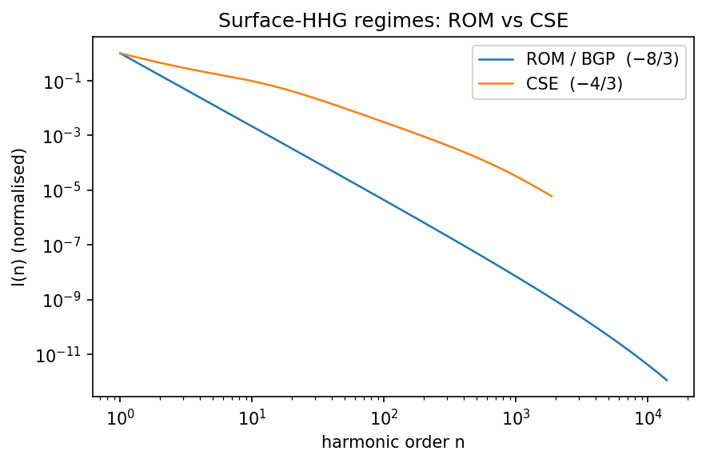
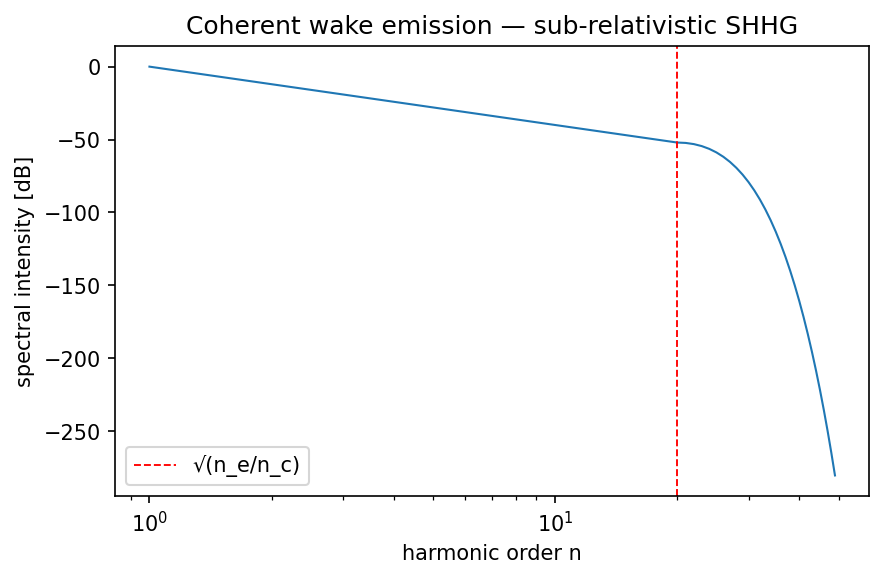
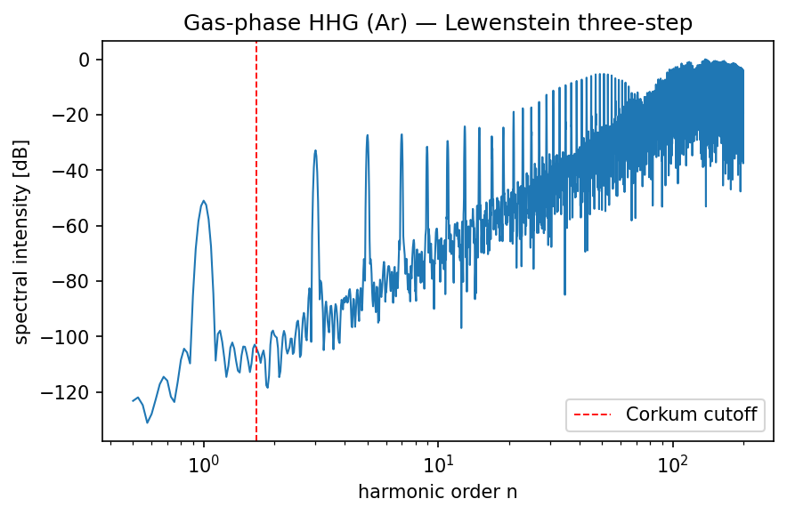
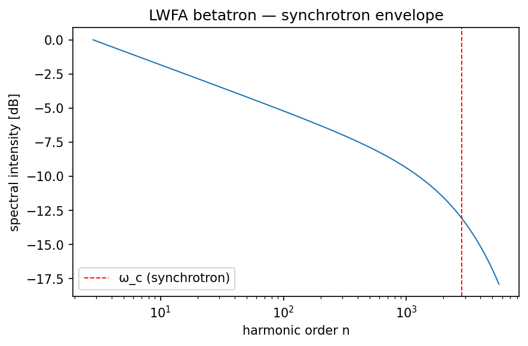
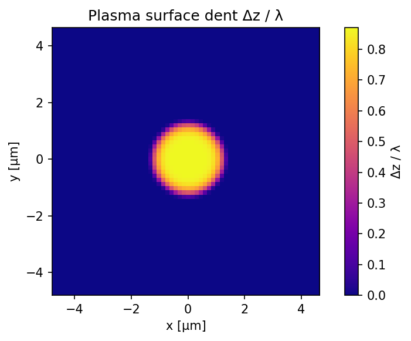
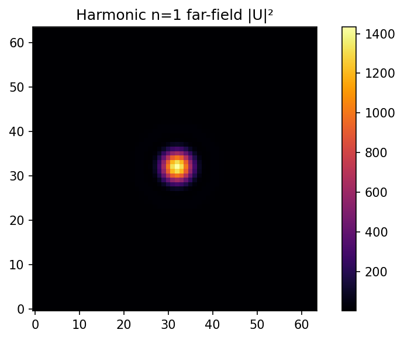
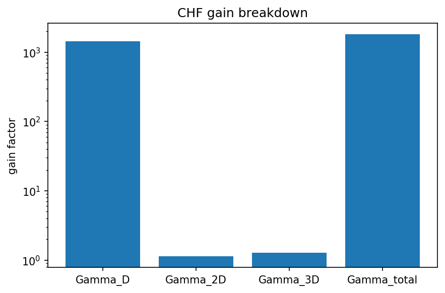
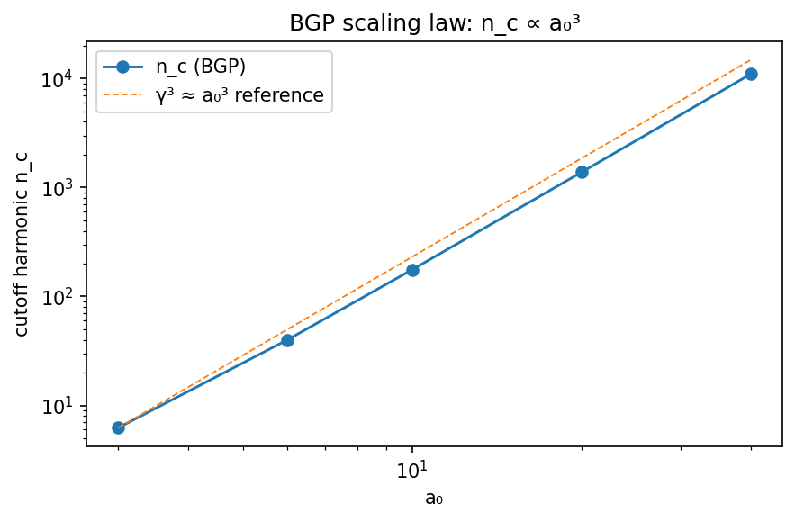
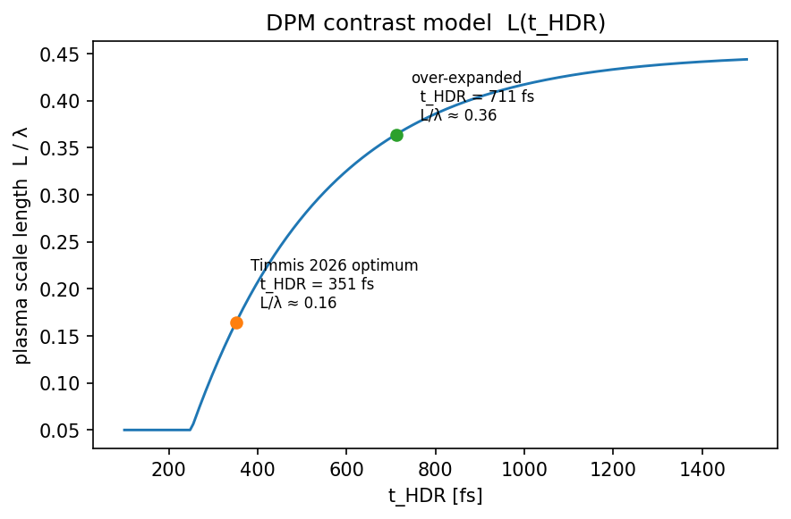
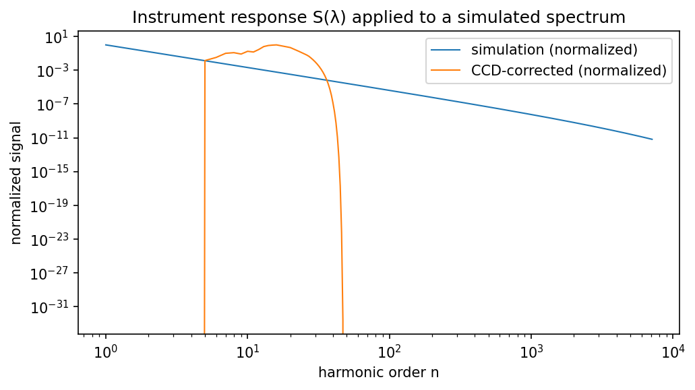

# Capability gallery

Every output the library can produce, in one place. Each figure is
rendered from the committed `docs/generate_images.py` script — run
`make images` to regenerate them all in ~4 s.

For **side-by-side comparisons across models** (every source on one
axis, parametric sweeps, decision matrix) see
[`comparison.md`](comparison.md); this gallery focuses on single-source
panels.

## Surface HHG spectra


Analytical BGP plateau at a₀ = 30 with a least-squares power-law fit.
Reproduce with:

```bash
harmony run configs/rom_default.yaml -o /tmp/bgp.h5
harmony plot /tmp/bgp.h5 -k spectrum
```



ROM (−8/3) and CSE (−4/3) envelopes overlaid; CSE dominates when the
gradient is short (L/λ ≲ 0.02) and a₀ is high. See
[`theory.md`](theory.md#regime-1--surface-hhg-on-overdense-plasma-rom--bgp--cse).



Sub-relativistic coherent wake emission (a₀ ≈ 0.3): the cutoff harmonic
is set by the plasma density, √(n_e / n_c), and does **not** scale with
a₀.

## Gas-phase HHG



Argon HHG at a₀ = 0.08 (~1.4 × 10¹⁴ W/cm²). The dashed red line marks the
Corkum cutoff ħω_max = I_p + 3.17 U_p.

```bash
harmony run configs/gas_hhg_default.yaml -o /tmp/gas.h5
harmony plot /tmp/gas.h5 -k spectrum
```

## LWFA betatron



Synchrotron-like envelope ξ · K_{2/3}(ξ/2)² for a 500 MeV e-beam in
10⁻³ n_c plasma with 1 μm betatron amplitude.

```bash
harmony run configs/betatron_default.yaml -o /tmp/bet.h5
harmony plot /tmp/bet.h5 -k spectrum
```

## Coherent Harmonic Focus (CHF) pipeline


Four-panel overview for the Timmis 2026 Gemini shot: spatially-averaged
spectrum, 2-D dent map Δz/λ, driver near-field |U₀|², and the CHF gain
breakdown Γ_D · Γ_2D · Γ_3D. One `harmony chf` invocation produces every
field needed here.



The plasma surface ponderomotively-dented by the driver. Depth scales
with a₀; curvature imprints the phase factor that focuses harmonics into
the CHF.

```bash
harmony chf  configs/chf_gemini.yaml -o /tmp/gemini.h5
harmony plot /tmp/gemini.h5 -k dent
```



|U(x, y, z, n = 1)|² after the CHF pipeline's Fraunhofer propagation —
stored at four diagnostic harmonics by default (configurable via
`numerics.diag_harmonics`).

```bash
harmony plot /tmp/gemini.h5 -k beam
```



Γ_D (temporal compression), Γ_2D (2-D spatial compression), Γ_3D = Γ_2D²
(axisymmetric 3-D extrapolation), and Γ_total = Γ_D · Γ_3D.

```bash
harmony plot /tmp/gemini.h5 -k chf
```

## Scans and parameter tuning



Five-point BGP scan showing cutoff harmonic n_c ∝ a₀³ across 1.5 decades.
The library's `scan` helper drops one HDF5 per grid point.

```bash
harmony scan configs/scan_example.yaml -p laser.a0=3,6,10,20,40 -d runs/a0
harmony plot runs/a0 -k scaling
```



The DPM contrast model's `L(t_HDR)` curve with markers at the Timmis 2026
optimum (351 fs) and over-expanded (711 fs) cases. Driven by
`harmonyemissions.contrast.scale_length_from_thdr` — no simulation
required.

## Instrument (detector) response



Simulated spectrum (blue) vs CCD-corrected signal (orange) after a 1.5 μm
Al filter, back-thinned CCD QE, and first-order grating. The 17 nm Al
L-edge suppresses the high-harmonic tail.

```bash
harmony run configs/rom_default.yaml -o /tmp/run.h5
harmony detector /tmp/run.h5 --al-um 1.5 -o /tmp/run_ccd.h5
harmony plot /tmp/run_ccd.h5 -k instrument
```

## Regenerating

Every image above is produced by `docs/generate_images.py`; the
committed PNGs are an on-disk cache. Run

```bash
make images
```

to redraw them after any physics / plotting change.
