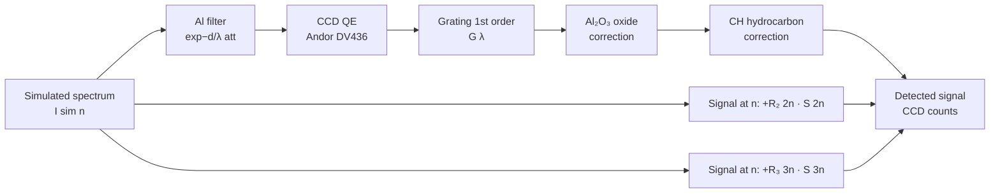

# XUV instrument modelling

Turns a simulated harmonic spectrum into the CCD counts a real flat-field
XUV spectrometer would record. Based on the detector model described in
the Methods § "Harmonic energy deconvolution" of Timmis et al. 2026.



## Response chain

Paper's eq. 1:

    S(λ) = Al · QE · G · Al₂O₃ · CH

- **Al** — aluminium filter transmission. Usually 0.2–3 μm thick; kills
  the driver wavelength, transmits 17–70 nm (XUV). See
  `harmonyemissions.detector.al_filter.al_filter_transmission`.
- **QE** — back-thinned CCD quantum efficiency (paper: Andor DV436).
- **G** — flat-field grating first-order efficiency. Paper uses a
  Shimadzu L0300-20-80, 300 line/mm.
- **Al₂O₃** — native oxide layer on the Al filter (~9 nm). Corrected
  separately because it has a different absorption spectrum from
  metallic Al.
- **CH** — hydrocarbon contamination layer (~5 nm, from vacuum chamber
  walls). Adds ~10–20 % attenuation.

## Grating higher-order overlap (eq. 6)

Second- and third-order diffraction of shorter-wavelength harmonics
land at the same pixel as longer-wavelength first-order harmonics, so
S_measured(n) = S_1(n) + R_2(2n)·S_1(2n) + R_3(3n)·S_1(3n) + ... The
paper fits R_m(n) with a logistic:

    R_m(n) = ν / (1 + exp(−k (n − n₀))) + b

with coefficients

| order | ν    | n₀ | k    | b    |
|-------|------|----|------|------|
| 2     | 0.92 | 40 | 0.37 | 0.12 |
| 3     | 0.79 | 44 | 0.44 | 0.13 |

`harmonyemissions.detector.grating.grating_order_ratio(n, order)` gives
these directly, and
`harmonyemissions.detector.grating.deconvolve_second_order(n, signal)`
inverts the contamination for a known 1-D spectrum.

## CLI

```bash
harmony detector /tmp/gemini.h5 --al-um 1.5 -o /tmp/gemini_ccd.h5
harmony plot /tmp/gemini_ccd.h5 -k instrument
```

The first command applies the full `S(λ)` response and second-order
overlap and writes the result to HDF5 as `instrument_spectrum`. The
second overlays simulated and CCD-corrected spectra.

## Python

```python
from harmonyemissions.detector.deconvolve import DetectorConfig, apply_instrument_response
cfg = DetectorConfig(al_thickness_um=1.5, include_second_order=True)
ccd = apply_instrument_response(result.spectrum, wavelength_um_driver=0.8, config=cfg)
```


*Normalised simulation (blue) vs CCD-corrected signal (orange) for a BGP
spectrum after a 1.5 μm Al filter, CCD QE, and first-order grating —
note the 17 nm Al L-edge suppresses the high-harmonic tail.*

## Limits

The transmission curves ship are simplified analytical fits — accurate
to a factor of ~2 in the pass band. For quantitative work against real
measurements, drop in the Henke-table values (paper's ref. 47) as a
lookup and extend `spectral_response` accordingly.
