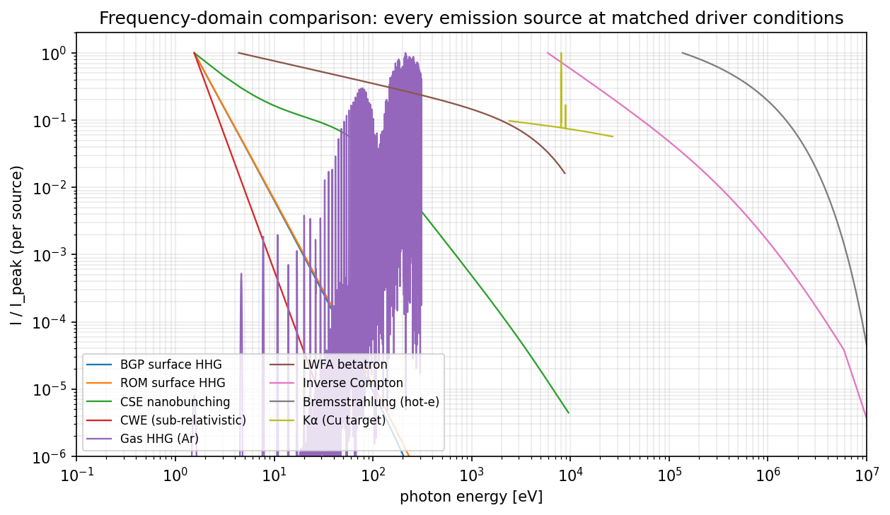
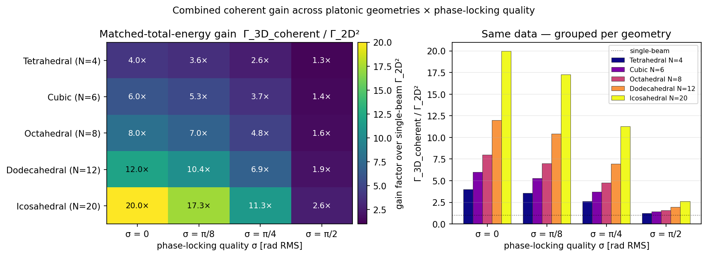
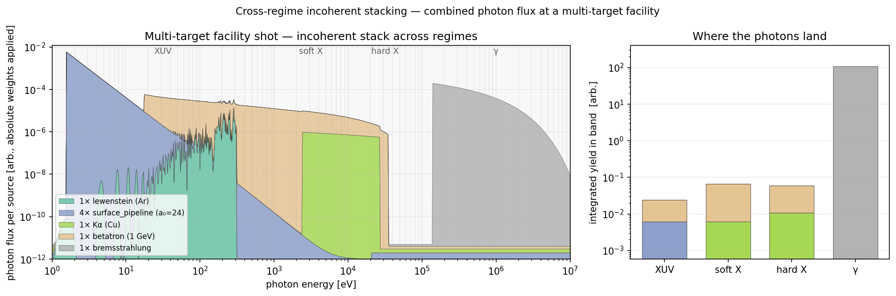
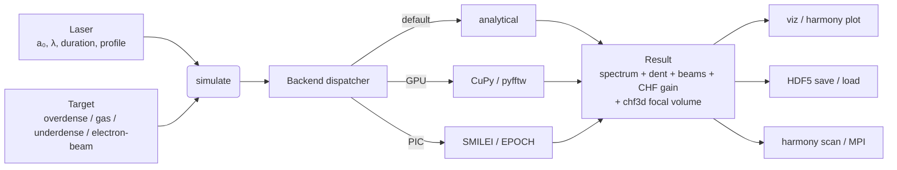
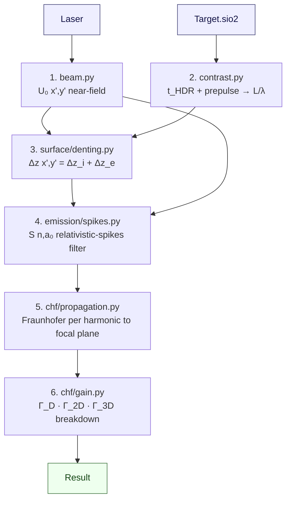
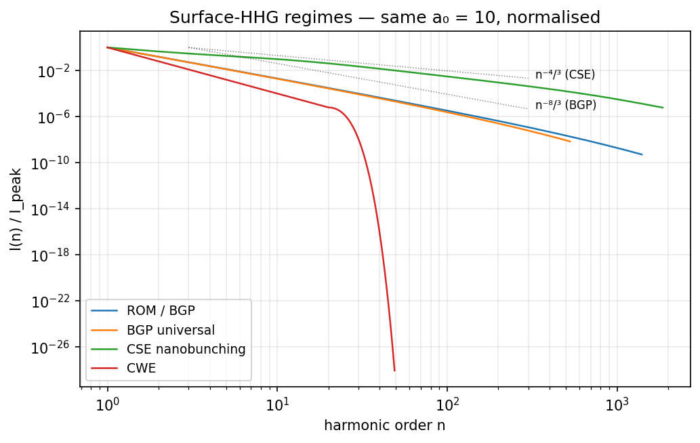
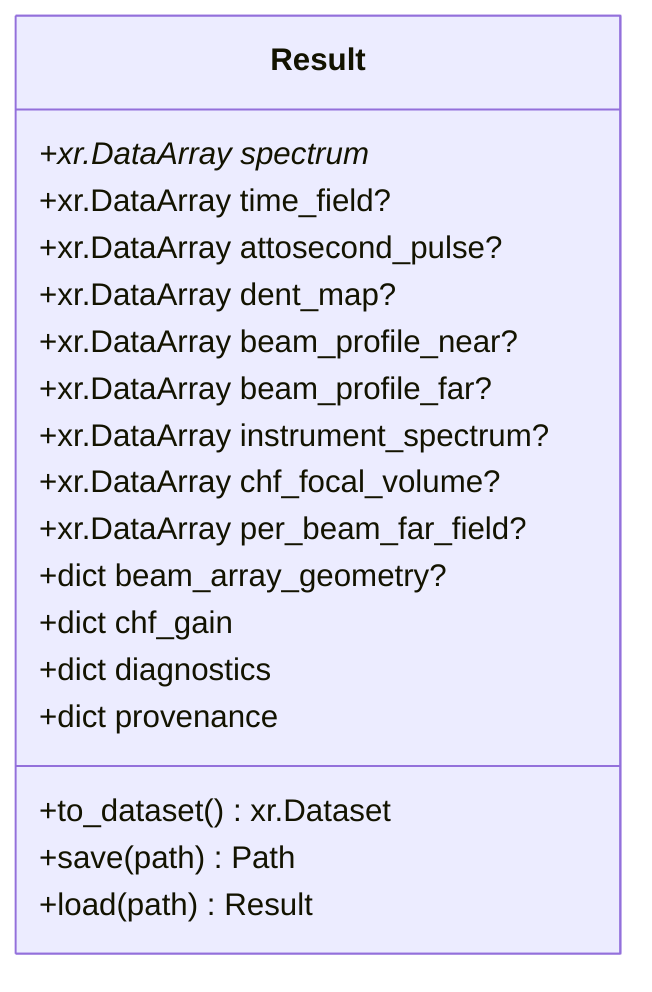

# Project overview

A Python library + CLI for simulating high-frequency laser-plasma emission
across every regime that produces coherent or quasi-coherent attosecond-to-MeV
photons — from the gentle Lewenstein three-step in a noble gas to the
relativistic spikes of a Coherent Harmonic Focus on overdense plasma. Each
regime ships an analytical kernel; PIC backends (SMILEI, EPOCH) plug into the
same interface for fidelity work.

The library is built around the **Timmis 2026 Coherent Harmonic Focus** result
([doi 10.1038/s41586-026-10400-2](https://doi.org/10.1038/s41586-026-10400-2))
and projects every other emission source into the same tooling: one `Result`
schema, one CLI, one persistence format, one parameter-sweep engine. See
[`docs/chf.md`](chf.md) for the CHF-specific walkthrough,
[`docs/chf3d.md`](chf3d.md) for the in-progress 3-D multi-beam extension, and
[`docs/theory.md`](theory.md) for the per-regime physics.


*Gemini-class CHF run from `configs/chf_gemini.yaml`: spectrum (top-left),
2-D dent map Δz/λ (top-right), driver near-field intensity (bottom-left),
and CHF gain breakdown Γ_D · Γ_2D · Γ_3D (bottom-right). Every panel comes
from one `harmony chf` invocation; the tooling is regime-agnostic.*

## Capability matrix

| Regime | Model(s) | Target kind | Photon band | Key scaling |
|---|---|---|---|---|
| Surface HHG (relativistic oscillating mirror) | `rom`, `bgp` | overdense | XUV → keV | I(n) ∝ n^(−8/3), n_c ∝ γ³ |
| Surface HHG (coherent synchrotron emission) | `cse` | overdense | XUV → keV | I(ω) ∝ ω^(−4/3), spikes |
| Sub-relativistic surface HHG (coherent wake) | `cwe` | overdense | XUV | cutoff ∝ √(n_e/n_c), a₀-indep. |
| Gas-phase HHG | `lewenstein` | gas | XUV | cutoff at I_p + 3.17·U_p |
| LWFA betatron | `betatron` | underdense | keV–MeV synch. | ω_c = (3/2) γ³ ω_β² r_β / c |
| Hot-electron bremsstrahlung | `bremsstrahlung` | overdense | keV–MeV continuum | dI/dE ∝ E₁(E/T_hot), Wilks |
| Kα fluorescence on solid targets | `kalpha` | overdense | element-pinned line | ω_K · σ_K(T_hot) |
| Inverse Compton scattering | `ics` | underdense / electron beam | MeV γ | E_γ = 4γ²ħω₀ / (1 + 4γE_L/m_e c²) |
| **Coherent Harmonic Focus (Timmis 2026)** | **`surface_pipeline`** | **overdense** | **XUV → keV, focused** | **I_CHF/I ∝ a₀³** |

Every model returns the same [`Result`](#result-schema) object. Plotting,
saving, and parameter sweeps are regime-agnostic.



*Every source on one normalised photon-energy axis, matched-driver
conditions. Full overlay set in [`docs/comparison.md`](comparison.md).*

## Combining sources

Two routes to "more photons", both supported by the existing tooling and
both fully documented in [`docs/combined_power.md`](combined_power.md):

- **Coherent within a regime** — N phase-locked drivers in a 3-D platonic
  geometry combine at one focal point. Closed-form matched-energy gain
  ⟨gain⟩ ≈ N · e^{−σ²} + (1 − e^{−σ²}); icosahedral N=20 buys 20× peak
  intensity at perfect locking, ~3× at σ = π/2. Geometry sets the
  ceiling, phase-locking quality sets how close you get.
- **Incoherent across regimes** — a multi-target facility shot stacks
  surface_pipeline + lewenstein + betatron + bremsstrahlung + Kα
  contributions per keV bin. The library has every primitive
  (`Result.spectrum.coords['photon_energy_keV']`); the notebook
  multiplies by per-regime conversion efficiencies and interpolates onto
  a common log-spaced axis.



*Matched-total-energy gain factor over single-beam Γ_2D² for the five
platonic geometries × four phase-locking RMS levels. Same data as a
heatmap (left) and grouped bars (right).*



*Multi-target facility shot — 4× surface_pipeline + 1× gas HHG + 1× LWFA
betatron + 1× Cu-Kα + 1× hot-electron bremsstrahlung. Photons add
incoherently per keV bin; the right panel shows where each source's
yield concentrates (XUV / soft-X / hard-X / γ).*

The runnable counterpart is
[`examples/12_combined_power_geometries.ipynb`](../examples/12_combined_power_geometries.ipynb).

## Architecture



Three orthogonal acceleration tiers, all opt-in:

- **CPU** (`pip install -e ".[accel]"`) — numba JIT in the Lewenstein inner
  loop, pyfftw plan caching + threaded FFTs, log-log Bessel cache for the
  betatron synchrotron envelope, vectorised surface-pipeline harmonic matrix.
- **GPU** (`pip install -e ".[gpu]"`) — `simulate(..., backend="cupy")` routes
  the 2-D FFT stack through CUDA when a device is available; raises
  `CupyNotAvailable` if not.
- **MPI** (`pip install -e ".[mpi]"`) — `harmony scan config.yaml --mpi` splits
  the Cartesian-product grid across `mpi4py` ranks.

See [`docs/parallel.md`](parallel.md) for the full performance discussion.

## The CHF pipeline

The unified six-stage `surface_pipeline` model implements Timmis 2026 Methods
eqs. 7–12 and is the only model that produces a CHF gain breakdown today.
Future 3-D N-beam extensions (see [`docs/chf3d.md`](chf3d.md)) plug into this
same pipeline.



Each stage is its own module with unit tests. New physics (e.g. a different
denting kernel or a 3-D coherent-superposition stage) becomes a sibling
module rather than a bolt-on. The architectural invariants are spelled out
in [`CLAUDE.md`](../CLAUDE.md).



*Surface-HHG regimes (`rom` / `bgp` / `cse` / `cwe`) at matched a₀ = 10,
with the −8/3 BGP and −4/3 CSE rulers overlaid.*

## Result schema

Every model returns one [`harmonyemissions.models.base.Result`](../src/harmonyemissions/models/base.py),
with `spectrum` mandatory and everything else optional. CLI, plotting, and
persistence all depend on this contract.



The trailing trio (`chf_focal_volume`, `per_beam_far_field`,
`beam_array_geometry`) is reserved for the in-progress 3-D N-beam extension —
see [`docs/chf3d.md`](chf3d.md). Persistence is round-trippable through
HDF5 (h5netcdf) — old runs continue to load and the new fields default to
`None`.

## Detector and instrument response

The `detector/` subpackage applies a band-aware response stack on top of any
`Result`:

- **XUV** — Al filter transmission, grating higher-order deconvolution, CCD
  quantum efficiency. Reproduces Timmis 2026 Methods eqs. 1, 6.
- **Soft X-ray** — kapton / beryllium filters + Si / CdTe detector chain.
- **Hard X-ray and γ** — multi-layer filter stacks (Cu / Ta / W / Pb), Ross
  pairs, scintillators (NaI, CsI, LYSO), and HPGe / CdTe direct detection.

```bash
harmony detector run.h5 --band auto --filter cu-50um --filter ta-1mm \
                          --detector csi-25mm --output run_csi.h5
```

See [`docs/instrument.md`](instrument.md) and
[`docs/hard_xray.md`](hard_xray.md).


*XUV stage of the instrument response (Al filter + grating + CCD QE) on a
ROM run — the dashed line is the bare spectrum, the solid line is the
post-instrument signal.*

## Quick start

### Python

```python
from harmonyemissions import Laser, Target, simulate

laser = Laser(a0=24.0, wavelength_um=0.8, duration_fs=50.0,
              spatial_profile="super_gaussian", spot_fwhm_um=2.0,
              super_gaussian_order=8, angle_deg=45.0)
target = Target.sio2(t_HDR_fs=351.0,
                     prepulse_intensity_rel=1e-3, prepulse_delay_fs=100.0)

result = simulate(laser, target, model="surface_pipeline")
print(result.chf_gain)        # Gamma_D, Gamma_2D, Gamma_3D, Gamma_total
result.save("gemini.h5")
```

### CLI

```bash
harmony validate configs/chf_gemini.yaml         # cheap schema check
harmony chf      configs/chf_gemini.yaml -o gemini.h5
harmony detector gemini.h5 --al-um 1.5 -o gemini_ccd.h5
harmony plot     gemini.h5 -k chf
harmony scan     configs/dpm_contrast_scan.yaml \
                 -p target.t_HDR_fs=351,711,1000 -d runs/ -j 4
```

## Provenance and reproducibility

Every saved `Result` carries a `provenance` block (model, backend, config
snapshot) and a `diagnostics` block (slope estimates, cutoff harmonics,
scale lengths, hot-electron temperatures). `harmony validate` runs the
Pydantic schema check without firing a simulation; `make check` runs ruff +
mypy + pytest with ≥80 % coverage.

The bundled SMILEI deck pins the exact PIC parameters used in Timmis 2026
Methods § "Numerical simulations" (512 cells/λ, 1024 steps/T₀, SiO₂
density, Silver–Müller BCs, Bouchard solver, 100 macro-electrons/cell);
those values are pinned by `tests/test_smilei_deck.py` so a stray edit
that breaks paper-fidelity is caught at CI time.

## Where to look next

- [`docs/theory.md`](theory.md) — every regime's physics derivation.
- [`docs/chf.md`](chf.md) — single-beam CHF pipeline walkthrough.
- [`docs/chf3d.md`](chf3d.md) — in-progress 3-D N-beam coherent harmonic
  focus extension (platonic / structured-light / time-multiplexed).
- [`docs/combined_power.md`](combined_power.md) — combined emission power
  across geometries (coherent within-regime) and facility shots
  (incoherent cross-regime), with decision matrix.
- [`docs/comparison.md`](comparison.md) — every source on one axis with
  decision matrix.
- [`docs/cli.md`](cli.md) — full CLI reference.
- [`docs/workflow.md`](workflow.md) — YAML-to-plot end-to-end walkthrough.
- [`docs/parallel.md`](parallel.md) — CPU / GPU / MPI acceleration.
- [`docs/backends.md`](backends.md) — SMILEI / EPOCH adapter setup.
- [`CLAUDE.md`](../CLAUDE.md) — architecture invariants for contributors.
