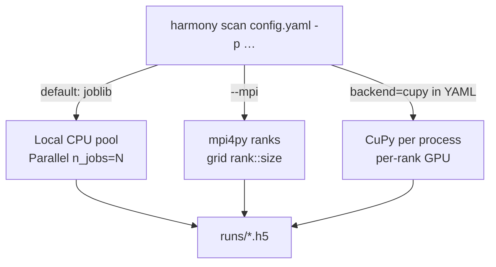
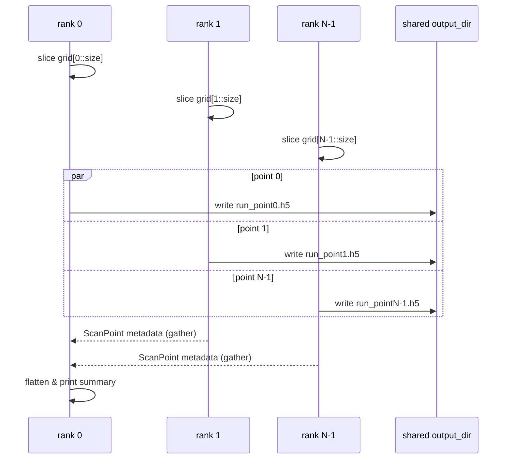

# Parallel execution — MPI scans + CuPy GPU backend



When the three tiers are combined (MPI across nodes, CuPy inside each rank)
each point in the Cartesian grid gets its own GPU-accelerated pipeline.

### Rank scatter / gather




Harmony of Emissions supports three tiers of parallelism:

1. **CPU multi-core** via `joblib` inside `harmony scan -j N`.
2. **CUDA single-GPU** via the `cupy` backend (`simulate(..., backend="cupy")`).
3. **Multi-node MPI** via `mpi4py`, invoked through `harmony scan --mpi`.

Each tier is an opt-in optional dependency; the core library runs on
plain NumPy + SciPy.

## Multi-core CPU scan (default)

```bash
harmony scan configs/dpm_contrast_scan.yaml \
    -p target.t_HDR_fs=200,300,400,500,700,1000 \
    -d runs/thdr/ -j 8
```

`joblib.Parallel(n_jobs=8)` spawns worker processes; each runs one grid
point. Deterministic — identical to a serial run with the analytical
backend (property-tested in `tests/test_scan.py`).

## CuPy GPU backend

Install: `pip install -e ".[gpu]"` (or `cupy-cuda12x` directly).

```python
from harmonyemissions import Laser, Target, simulate
r = simulate(laser, target, model="surface_pipeline", backend="cupy")
```

The CuPy backend runs the same pipeline as the analytical path but
routes 2-D FFTs through `cupy.fft` (via `harmonyemissions.accel.fft`).
Falls back with a clear `CupyNotAvailable` error if CuPy isn't
installed or no CUDA device is visible.

At 128² grids the speedup over the CPU path is modest (host↔device
transfer dominates); the payoff shows up at 512²+ where the Fraunhofer
stack is the bottleneck.

## MPI multi-node scan

Install: `pip install -e ".[mpi]"` (requires a working `mpirun`).

```bash
mpirun -n 8 harmony scan configs/dpm_contrast_scan.yaml \
    -p target.t_HDR_fs=200,300,400,500,700,1000 \
    --mpi -d runs/thdr/
```

Rank `k` of `n_ranks` takes `grid[k::n_ranks]` and writes outputs into
the shared `-d` directory. Rank 0 gathers the metadata and prints the
summary.

Call it from Python if you prefer:

```python
from harmonyemissions.parallel import run_scan_mpi
points = run_scan_mpi(base_cfg, grid, output_dir="runs/", gather=True)
```

`gather=False` returns only each rank's own slice, avoiding the all-to-root
MPI collective when the caller plans to post-process files directly.

## Combining them

MPI + CuPy gives you coarse-grained parallelism across nodes and
fine-grained GPU acceleration inside each point:

```bash
mpirun -n 4 harmony scan configs/chf_sel.yaml \
    -p laser.a0=50,80,100,130 --mpi -d runs/sel/
```

if each rank is scheduled on a CUDA-equipped node and
`backend: cupy` is set in the YAML, each rank offloads its pipeline to
its local GPU.
