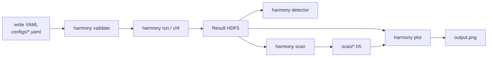

# Workflow: from YAML config to spectrum plot

A typical exploration loop is four commands long. This page walks through
each of them, shows the intermediate artifacts, and explains the common
tuning knobs.



## 1. Write a config

A config file is a validated YAML document that describes exactly one
run. See [`configs/rom_default.yaml`](../configs/rom_default.yaml) for a
minimal example:

```yaml
model: rom
backend: analytical

laser:
  a0: 10.0
  wavelength_um: 0.8
  duration_fs: 8.0
  polarization: p
  envelope: gaussian

target:
  kind: overdense
  n_over_nc: 100.0
  gradient_L_over_lambda: 0.1

numerics:
  n_periods: 30.0
  samples_per_period: 512
  harmonic_window: [20.0, 60.0]
```

Every field is validated against
[`harmonyemissions.config.RunConfig`](../src/harmonyemissions/config.py):
missing keys, out-of-range values, and regime mismatches (`model: rom`
with `target.kind: gas`) are reported with a clear error before any
expensive work begins.

## 2. Validate the config

Before dispatching to a PIC backend that might cost hours of wall clock,
it is cheap to run

```bash
harmony validate configs/rom_default.yaml
```

This loads the YAML, applies pydantic validation, and prints a one-line
summary.

## 3. Run the simulation

```bash
harmony run configs/rom_default.yaml -o run.h5
```

The CLI:

1. Loads and validates the config.
2. Builds a `Laser` and `Target`.
3. Dispatches to the named `backend.simulate(...)`.
4. The backend runs the named model and returns a `Result`.
5. The `Result` is serialized to HDF5 (via xarray + h5netcdf).
6. A flat diagnostic summary is printed.

Inside the HDF5 file you will find:

- `spectrum` — dI/dω vs harmonic order n.
- `time_field` — Doppler-mapped reflected field E(t) (surface models only).
- `attosecond_pulse` — bandpass-filtered time-domain pulse.
- `diagnostics_json`, `provenance_json` — flat dicts of scalar summaries
  and run provenance (laser + target inputs, model name, backend,
  references).

## 4. Plot the results

```bash
harmony plot run.h5 -k spectrum    # harmonic spectrum with power-law fit
harmony plot run.h5 -k pulse       # attosecond pulse (if a window was set)
harmony plot runs/  -k scaling     # n_c vs a₀ across a scan directory
```

Or open the `Result` in Python for custom work:

```python
from harmonyemissions import load_result
from harmonyemissions.viz import plot_spectrum, plot_pulse

r = load_result("run.h5")
print(r.summary())
plot_spectrum(r)
plot_pulse(r)
```

Example outputs:


*Spectrum from `harmony plot run.h5 -k spectrum` — log–log axes with a
least-squares power-law fit overlaid.*


*`harmony plot chf.h5 -k dent` on a `surface_pipeline` run — 2-D plasma
dent Δz/λ in the focal plane.*


*`harmony plot runs/ -k scaling` across a directory of scan outputs —
cutoff harmonic tracks the γ³ ≈ a₀³ reference.*

## Parameter sweeps

For tuning studies — what `a₀` do I need for the 50th harmonic? what
gradient minimizes reflected-pulse duration? — use `harmony scan`:

```bash
harmony scan configs/scan_example.yaml \
    -p laser.a0=1,2,5,10,20 \
    -p target.gradient_L_over_lambda=0.01,0.05,0.1 \
    -d runs/ -j 4
```

This sweeps the Cartesian product of all `-p` specs, runs each point in
parallel (via joblib), and writes one HDF5 per combination. Afterward
you can load the whole scan back in with xarray:

```python
import xarray as xr
from pathlib import Path
from harmonyemissions import load_result

paths = sorted(Path("runs/").glob("*.h5"))
results = [load_result(p) for p in paths]
# ... plot, regress, tabulate.
```

## Switching to a higher-fidelity backend

Every simulation is parametrized by a `backend` field (default:
`"analytical"`). Flip it to `"smilei"` or `"epoch"` and — provided the
external PIC executable is on `$PATH` — the same config file now dispatches
to a full PIC run. See [`backends.md`](backends.md) for the details and
current limitations of each adapter.
